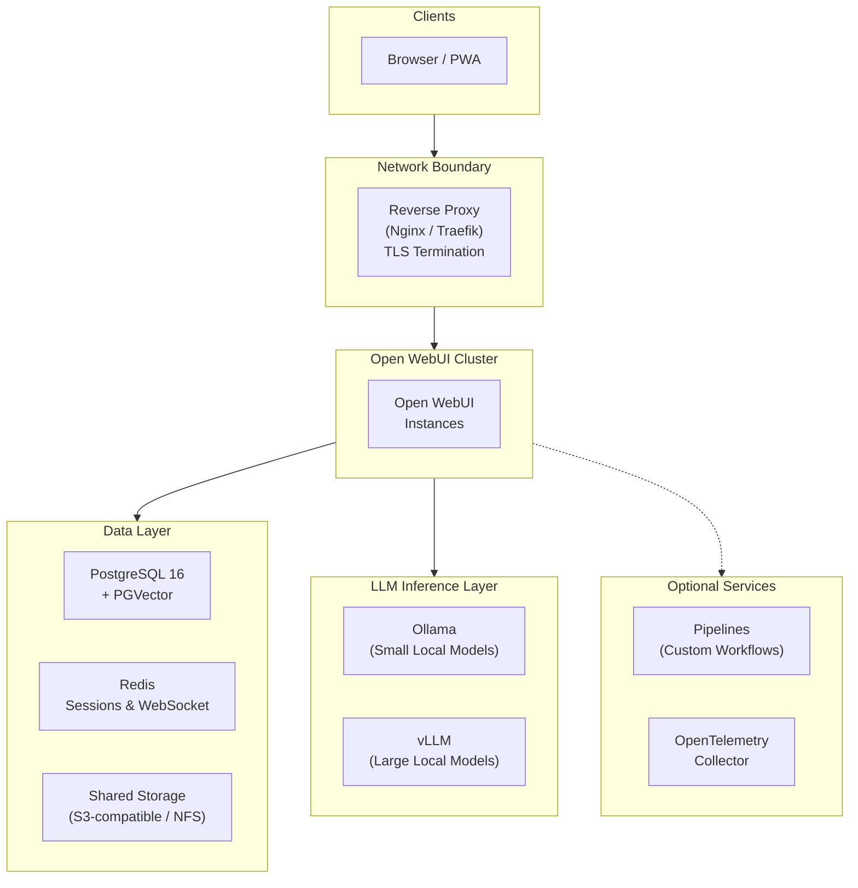

# Deploying Private AI for the Legal Industry with Open WebUI

---

## AI Adoption Challenges for the Legal Industry

In many industries, AI is reshaping how knowledge workers operate. For law firms, the productivity gains from AI appear tempting, but the stakes are uniquely unforgiving. Three challenges have slowed adoption across the industry:

**AI model hallucinations are a liability.** In 2023, a New York attorney submitted a brief citing six cases fabricated by ChatGPT. The court sanctioned both the lawyer and his firm. Since then, multiple bar associations have issued ethics opinions requiring attorneys to verify AI-generated content, but verification without source traceability is difficult at scale.

**Client data in hosted models is a privilege risk.** Sending case materials to cloud AI providers creates potential waiver of attorney-client privilege under ABA Model Rule 1.6. Frontier labs offer contractual assurances that your data won't be used for training, but you have zero visibility into whether those promises are honored. For firms handling sensitive litigation, M&A, or regulatory matters, "trust us" isn't an acceptable security posture.

**Compliance requirements are multiplying.** State bar AI disclosure rules, GDPR for international practices, and internal governance obligations all demand auditable, controllable AI infrastructure; not a SaaS subscription with opaque data handling.

These challenges share a common root: firms need AI they can *control*, *observe*, and *validate*, not just *consume*.

---

## Open WebUI for the Legal Industry

[Open WebUI](https://docs.openwebui.com/) is a self-hosted AI platform that is designed to solve these problems.

**Data sovereignty by design.** Open WebUI runs entirely on your company's infrastructure, whether it's on-premise, running in a private cloud, or air-gapped. By downloading and self-hosting open source models to use with Open WebUI, client data never leaves your network. There is no third-party training risk because there is no third party. 

**RAG with citations to ground responses.** Retrieval-Augmented Generation (RAG) lets attorneys query the firm's own documents — briefs, precedents, statutes, internal memos — with inline citations and relevance scores. This doesn't eliminate hallucination, but it provides the traceability that verification requires, and makes it much more likely that your AI's responses are grounded in reality. 

**Granular access control for practice groups.** Role-based permissions, user groups mapped to practice areas, and model-level access restrictions let you tailor AI capabilities per team. An administrator setting can even prevent IT staff from viewing privileged conversations, maintaining attorney-client privilege within your law firm. 

**Audit-ready infrastructure.** Chat retention controls, configurable logging via OpenTelemetry, LDAP/SSO integration, and the ability to prevent users from deleting chat history create the compliance surface that regulators and ethics committees expect.

The next section describes a production architecture that puts these capabilities into practice, specifically for the Legal Industry.

---

## Scaled Architecture for the Legal Industry

The architecture below is designed for large law firms (200–1,000+ attorneys) requiring high availability, data isolation, and compliance-ready infrastructure. Every component serves a specific legal-industry need, without adding unnecessary bloat.

### Architecture Overview

### Component Breakdown

#### Reverse Proxy + TLS Termination

All traffic enters through a single reverse proxy that enforces TLS encryption in transit. This is your network boundary — nothing reaches Open WebUI without passing through it. For firms with existing network infrastructure, this integrates with your current certificate management and firewall rules. The proxy also handles load balancing across Open WebUI instances, distributing requests evenly to prevent any single node from becoming a bottleneck.

#### Stateless Open WebUI Nodes

Open WebUI instances run as stateless containers. This means you can scale horizontally, adding nodes during peak usage (e.g., trial preparation periods) and removing them during quieter times. This allows you to lose any single node without service interruption. All persistent state lives in PostgreSQL and Redis, so no data is lost if a container restarts.

Key environment variables for this deployment pattern:
- `ENABLE_ADMIN_CHAT_ACCESS=False` — Protects attorney-client privilege from internal IT access
- `ENABLE_SIGNUP=False` — No self-registration; user provisioning is controlled
- `DEFAULT_USER_ROLE=pending` — New accounts require admin approval before accessing any AI capabilities
- `ENABLE_ADMIN_EXPORT=False` — Prevents bulk data extraction

> For the complete Docker Compose configuration and all environment variables, see the [Setup Guide](SETUP-GUIDE.md).

#### PostgreSQL + PGVector

PostgreSQL serves dual duty: it stores chat history, user records, and configuration (the audit trail), and with the PGVector extension, it also acts as the vector database for RAG knowledge bases. This consolidation simplifies operations — one database to back up, monitor, and secure rather than two.

For legal teams, the audit trail matters most. Every conversation is persisted, timestamped, and associated with a user identity. Combined with the `USER_PERMISSIONS_CHAT_DELETE=False` setting, this creates an immutable record that satisfies regulatory and internal governance requirements. Connection pooling and proper indexing ensure performance holds at firm-wide scale.

#### Redis

Redis handles session management and WebSocket coordination across stateless nodes. When an attorney starts a conversation on one Open WebUI instance and their next request routes to a separate instance, Redis ensures the session is seamless. Without it, multi-node deployments cannot function. Redis Sentinel or Cluster mode is recommended for production HA.

#### Shared Document Storage

Uploaded documents — case files, briefs, internal memos, policy documents — need to be accessible from any Open WebUI instance. An S3-compatible object store (MinIO for on-prem, or your cloud provider's offering) or NFS mount provides this shared layer. All documents processed through RAG are stored here, and Open WebUI's file management dashboard provides a centralized interface to search, view, and manage them.

#### Ollama — Local Model Inference

Ollama runs models directly on your infrastructure. This is the core of the data sovereignty promise: prompts, completions, and any intermediate representations never leave your network. Ollama supports GPU passthrough via NVIDIA Container Toolkit, and Open WebUI can load-balance across multiple Ollama instances for concurrent users.

#### vLLM — GPU-Optimized Inference

For firms needing maximum throughput from large models (70B+ parameters), vLLM provides optimized GPU inference with continuous batching and PagedAttention. It exposes an OpenAI-compatible API, so Open WebUI connects to it just like any other API endpoint — just plug the vLLM URL in as an OpenAI-compatible endpoint, and Open WebUI will handle the connection.

vLLM is the right choice when:
- Dozens of attorneys are running concurrent queries
- You're serving 70B+ parameter models that need tensor parallelism across multiple GPUs
- You need deterministic throughput guarantees for SLA-sensitive workflows

Both Ollama and vLLM can run side-by-side. A common pattern is to use Ollama to serve smaller models for quick tasks (summarization, Q&A), while using vLLM to handle the large reasoning models for complex legal analysis.

#### Pipelines (Optional)

Open WebUI's [Pipelines framework](https://docs.openwebui.com/features/extensibility/pipelines) enables custom processing logic as modular plugins. Legal-relevant pipelines include:

- **Rate limiting**: Prevent runaway local LLM usage during bulk document processing
- **Toxic message filtering**: Content safety guardrails
- **LLM-Guard prompt injection scanning**: Protect against adversarial inputs that might attempt to extract privileged information
- **Langfuse monitoring**: Detailed usage analytics per user, model, and practice group
- **Custom RAG pipelines**: Firm-specific retrieval logic, e.g., prioritizing recent case law or jurisdiction-specific statutes

#### OpenTelemetry (Optional)

Built-in OpenTelemetry support exports traces, metrics, and logs to your existing observability stack (Prometheus, Grafana, Jaeger, Splunk, Datadog). For firms subject to audit, this provides infrastructure-level evidence that AI systems are operating within policy.

### RBAC Configuration for Practice Groups

Open WebUI's group system maps naturally to law firm organizational structures. Each practice group becomes a user group with tailored permissions:

| Practice Group | Models Accessible | Knowledge Bases | Special Permissions |
|---|---|---|---|
| **Litigation** | Full model suite | Case law, motions, discovery templates | Web search enabled |
| **Corporate / M&A** | Full model suite | Deal templates, regulatory filings, due diligence checklists | Document extraction enabled |
| **Intellectual Property** | Full model suite | Patent databases, prosecution templates | Code interpreter enabled |
| **Tax** | Reasoning models only | Tax code, IRS guidance, firm tax opinions | Restricted to RAG-only mode |
| **Paralegals / Staff** | Small models only | Firm procedures, HR policies | No file upload, no web search |

Groups support OAuth synchronization with your identity provider (Okta, Azure AD, Google Workspace), so practice group membership stays in sync with your firm's directory automatically via SCIM 2.0 provisioning.
---

## Get Started

Open WebUI is **free to use today** with no restrictions, hidden limits, or feature gating. You can deploy the architecture described above right now.

### Start Building

The complete Docker Compose stack, setup scripts, RBAC configuration guide, and security hardening checklist for this architecture are available in our companion technical guide:

**[Legal Industry Setup Guide →](SETUP-GUIDE.md)**

This guide is designed to hand directly to your engineering or IT team. It includes everything needed to spin up a production-ready deployment.

### Enterprise Support

For firms that need additional assurance, [Open WebUI Enterprise](https://docs.openwebui.com/enterprise/) provides:

- **Security & compliance support** — Guidance for SOC 2, HIPAA, GDPR, FedRAMP, and ISO 27001 alignment
- **White-label branding** — Match the AI interface to your firm's identity
- **Dedicated support & SLAs** — Direct engineering access for architecture review and incident response
- **No vendor lock-in** — Your data, your infrastructure, your choice of models. Always.

Open WebUI is sustained by its users. Enterprise licenses fund ongoing development while giving your firm dedicated support and customization capabilities.

**[Contact Enterprise Sales → sales@openwebui.com](mailto:sales@openwebui.com)**

---

*Open WebUI is one of the fastest-growing AI platforms in the world, powering deployments at Fortune 500 companies, research institutions, and government agencies. [Learn more →](https://docs.openwebui.com/enterprise/customers)*