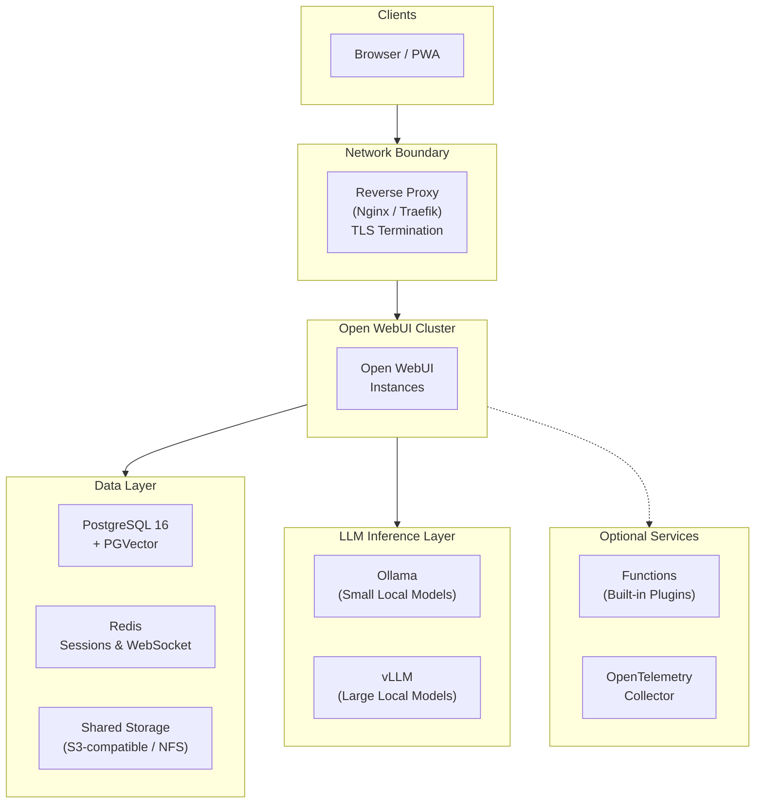

# Private AI for the Legal Industry

*For managing partners, CIOs, and legal technology leaders evaluating AI solutions for their firm.*

<!-- TODO: Replace with hero image for social sharing previews -->

---

## The Problem

In 2023, a New York attorney submitted a brief citing six cases fabricated by ChatGPT. The court sanctioned both the lawyer and his firm. Since then, multiple bar associations have issued ethics opinions requiring attorneys to verify AI-generated content — but verification without source traceability is difficult at scale.

That's just one of three challenges slowing AI adoption across the legal industry:

**Hallucinations are a liability.** AI-generated content that cites nonexistent cases or misrepresents holdings exposes firms to sanctions, malpractice claims, and reputational damage. Attorneys need traceability — the ability to verify every claim against a source document.

**Client data in hosted models is a privilege risk.** Sending case materials to cloud AI providers raises concerns about waiver of attorney-client privilege under ABA Model Rule 1.6. While some ethics opinions (e.g., ABA Formal Opinion 477R) suggest cloud use can be permissible with adequate safeguards, many firms handling sensitive litigation, M&A, or regulatory matters prefer to eliminate third-party data exposure entirely.

**Compliance requirements are multiplying.** State bar AI disclosure rules, GDPR for international practices, and internal governance obligations all demand auditable, controllable AI infrastructure — not a SaaS subscription with opaque data handling.

These challenges share a common root: firms need AI they can *control*, *observe*, and *validate* — not just *consume*.

---

## What a Legal AI Platform Needs

There's no shortage of legal AI products on the market — many of them polished, well-funded, and easy to adopt. But they share a common limitation: your data runs through someone else's infrastructure, governed by someone else's terms. For routine work with low-sensitivity data, that tradeoff may be acceptable. For firms handling privileged litigation, regulatory investigations, or M&A due diligence, it often isn't.

Self-hosting gives you something no SaaS vendor can: the ability to verify every claim about data handling by inspecting the infrastructure yourself. Here's what that looks like in practice — and how [Open WebUI](https://docs.openwebui.com/), a self-hosted AI platform, delivers it:

- **Your data never leaves your network.** Open WebUI runs entirely on your infrastructure — on-premise, private cloud, or air-gapped. By self-hosting open-source models, there is no third-party data exposure. No training risk. No external API calls.

- **AI responses cite their sources.** Attorneys can query the firm's own documents — briefs, precedents, statutes, internal memos — and get responses with inline citations and relevance scores. This doesn't eliminate hallucination, but it can provide the traceability that verification requires.

- **Access control mirrors your org structure.** Role-based permissions map to practice groups. Administrators can be prevented from viewing privileged conversations. Model access, document access, and feature access are all controlled per group.

- **Every conversation is auditable.** Chat retention controls, configurable logging, SSO integration, and the ability to prevent users from deleting chat history create the compliance surface that regulators and ethics committees expect.

### What This Looks Like in Practice

When configured with a firm's internal document library, an associate preparing a motion types their question into Open WebUI. The response draws from the firm's briefs and cites the specific documents used, with relevance scores for each source. The associate clicks through to verify each citation against the original. The full conversation is logged under their user account, searchable and auditable. No data leaves the firm's servers at any point.

For a partner reviewing the associate's work, the audit trail shows exactly which AI-generated content was used, what sources it was grounded in, and when. This is the traceability that bar ethics opinions are demanding.

<!-- TODO: Replace with real screenshot of chat UI showing inline citations and source panel -->

---

## Access Control for Practice Groups

Open WebUI's group system maps naturally to law firm organizational structures. Each practice group gets tailored permissions:

<!-- TODO: Replace with screenshot of Admin Panel → Groups showing practice groups -->

| Practice Group | AI Capabilities | Knowledge Bases | Special Permissions |
|---|---|---|---|
| **Litigation** | Full | Case law, motions, discovery templates | Web search enabled |
| **Corporate / M&A** | Full | Deal templates, regulatory filings, due diligence checklists | Document extraction *(extract structured data from contracts and filings)* |
| **Intellectual Property** | Full | Patent databases, prosecution templates | Code interpreter *(run analysis scripts on patent claim data)* |
| **Tax** | Advanced analysis only | Tax code, IRS guidance, firm tax opinions | RAG-only mode *(responses limited to firm documents, no general knowledge)* |
| **Paralegals / Staff** | Basic tasks only | Firm procedures, HR policies | No file upload, no web search |

Groups synchronize with your identity provider (Okta, Azure AD, Google Workspace) via OAuth, so practice group membership stays in sync with your firm's directory automatically.

---

## What a Production Deployment Looks Like

*This section is a reference for your IT or engineering team. If you're evaluating Open WebUI at a strategic level, the key takeaway is: it runs entirely on your existing infrastructure (VMware, Azure, AWS, or bare metal), scales with your firm, and requires no external dependencies.*

For large firms (200–1,000+ attorneys), a production deployment needs high availability, data isolation, and compliance-ready infrastructure. Here's the reference architecture — for full deployment instructions, see the **[Technical Setup Guide](setup.md)**.

**Key design decisions:**
- **Stateless application nodes** — horizontal scaling allows capacity to flex with demand across the firm
- **All inference runs locally** — via Ollama (lightweight models) and vLLM (large models with GPU optimization); no prompts leave the network
- **Unified data layer** — PostgreSQL handles both application data and vector search, reducing operational complexity
- **Redis session coordination** — enables multi-node deployments where any instance can serve any request seamlessly

---

## Get Started

Open WebUI is **free to use**. Infrastructure costs depend on your firm's scale — a single practice group pilot can run on one GPU server in your existing cloud environment or on-premise, while the full production architecture above involves dedicated compute and storage. A pilot can typically be running within hours; a full production rollout takes a few weeks.

The complete Docker Compose stack, security hardening checklist, RBAC configuration guide, and backup strategy are in our companion technical guide:

**[Legal Industry Technical Setup Guide →](setup.md)**

### Enterprise Support

If your firm wants hands-on support, [Open WebUI Enterprise](https://docs.openwebui.com/enterprise/) is available for teams that prefer not to go it alone:

- **Security & compliance guidance** — SOC 2, HIPAA, GDPR, FedRAMP, and ISO 27001 alignment
- **White-label branding** — Match the AI interface to your firm's identity
- **Dedicated support & SLAs** — Direct engineering access for architecture review and incident response

Your data, your infrastructure, your choice of models — with Open WebUI.

**[Learn more about Enterprise → sales@openwebui.com](mailto:sales@openwebui.com)**

---

*Open WebUI is free to use and self-hostable. It powers AI deployments at organizations ranging from small teams to Fortune 500 companies. [See who's using Open WebUI →](https://docs.openwebui.com/enterprise/customers/)*