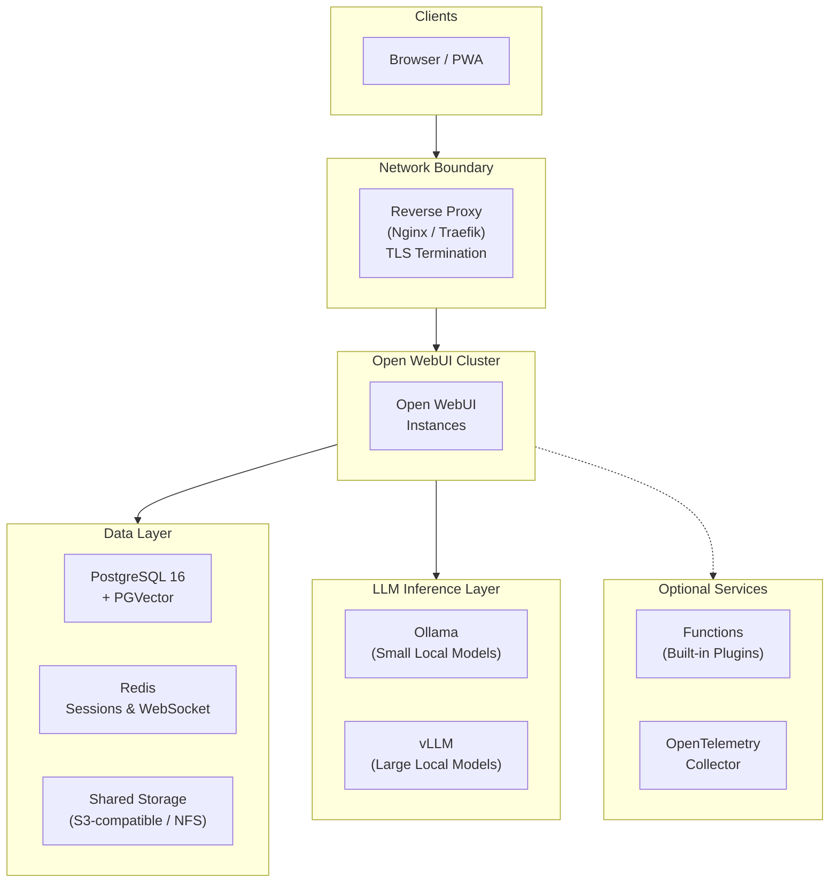

# Private AI for the Legal Industry with Open WebUI

---

## AI Adoption Challenges for the Legal Industry

In many industries, AI is reshaping how knowledge workers operate. For law firms, the productivity gains from AI appear tempting, but the stakes are uniquely unforgiving. Three challenges have slowed adoption across the industry:

**AI model hallucinations are a liability.** In 2023, a New York attorney submitted a brief citing six cases fabricated by ChatGPT. The court sanctioned both the lawyer and his firm. Since then, multiple bar associations have issued ethics opinions requiring attorneys to verify AI-generated content, but verification without source traceability is difficult at scale.

**Client data in hosted models is a privilege risk.** Sending case materials to cloud AI providers raises concerns about waiver of attorney-client privilege under ABA Model Rule 1.6. While some ethics opinions (e.g., ABA Formal Opinion 477R) suggest cloud use can be permissible with adequate safeguards, many firms handling sensitive litigation, M&A, or regulatory matters prefer to eliminate third-party data exposure entirely rather than rely on contractual assurances they cannot independently verify.

**Compliance requirements are multiplying.** State bar AI disclosure rules, GDPR for international practices, and internal governance obligations all demand auditable, controllable AI infrastructure — not a SaaS subscription with opaque data handling.

These challenges share a common root: firms need AI they can *control*, *observe*, and *validate* — not just *consume*.

---

## How Open WebUI Solves These Problems

[Open WebUI](https://docs.openwebui.com/) is a self-hosted AI platform designed to give law firms full control over their AI infrastructure. Here's what that means in practice:

- **Your data never leaves your network.** Open WebUI runs entirely on your infrastructure — on-premise, private cloud, or air-gapped. By self-hosting open-source models, there is no third-party data exposure. No training risk. No external API calls.

- **AI responses cite their sources.** Retrieval-Augmented Generation (RAG) lets attorneys query the firm's own documents — briefs, precedents, statutes, internal memos — with inline citations and relevance scores. This doesn't eliminate hallucination, but it provides the traceability that verification requires.

- **Access control mirrors your org structure.** Role-based permissions map to practice groups. Administrators can be prevented from viewing privileged conversations. Model access, document access, and feature access are all controlled per group.

- **Every conversation is auditable.** Chat retention controls, configurable logging, SSO integration, and the ability to prevent users from deleting chat history create the compliance surface that regulators and ethics committees expect.

---

## Get Started

Open WebUI is **free to use** with no restrictions, hidden limits, or feature gating. You can deploy a production-ready stack today.

### For Your Engineering Team

The complete Docker Compose stack, security hardening checklist, RBAC configuration guide, and backup strategy are in our companion technical guide. It includes everything needed to stand up a production deployment:

**[Legal Industry Technical Setup Guide →](setup.md)**

### Enterprise Support

Everything above works without a license — Open WebUI is fully open source and always will be. If your firm wants hands-on support, [Open WebUI Enterprise](https://docs.openwebui.com/enterprise/) is available for teams that prefer not to go it alone:

- **Security & compliance guidance** — SOC 2, HIPAA, GDPR, FedRAMP, and ISO 27001 alignment
- **White-label branding** — Match the AI interface to your firm's identity
- **Dedicated support & SLAs** — Direct engineering access for architecture review and incident response

Your data, your infrastructure, your choice of models — with or without us.

**[Learn more about Enterprise → sales@openwebui.com](mailto:sales@openwebui.com)**

---

## Architecture at a Glance

The architecture below is designed for large law firms (200–1,000+ attorneys) requiring high availability, data isolation, and compliance-ready infrastructure. For the full component breakdown, environment variable reference, and deployment instructions, see the **[Technical Setup Guide](setup.md)**.

**Key design decisions:**
- **Stateless application nodes** scale horizontally — add capacity during trial preparation, scale down during quieter periods
- **All models run locally** via Ollama (small/fast models) and vLLM (large reasoning models) — prompts never leave your network
- **PostgreSQL handles both data and vectors** — one database to back up, monitor, and secure
- **Redis coordinates sessions** across nodes so attorneys get seamless experiences regardless of which node handles their request

---

## Access Control for Practice Groups

Open WebUI's group system maps naturally to law firm organizational structures. Each practice group gets tailored permissions:

| Practice Group | Models Accessible | Knowledge Bases | Special Permissions |
|---|---|---|---|
| **Litigation** | Full model suite | Case law, motions, discovery templates | Web search enabled |
| **Corporate / M&A** | Full model suite | Deal templates, regulatory filings, due diligence checklists | Document extraction enabled |
| **Intellectual Property** | Full model suite | Patent databases, prosecution templates | Code interpreter enabled |
| **Tax** | Reasoning models only | Tax code, IRS guidance, firm tax opinions | Restricted to RAG-only mode |
| **Paralegals / Staff** | Small models only | Firm procedures, HR policies | No file upload, no web search |

Groups synchronize with your identity provider (Okta, Azure AD, Google Workspace) via OAuth, so practice group membership stays in sync with your firm's directory automatically.

For step-by-step RBAC configuration instructions, see the **[Technical Setup Guide → RBAC Configuration](setup.md#rbac-configuration-guide)**.

---

*Open WebUI is one of the fastest-growing open-source AI platforms, powering deployments across enterprise, research, and government. [Learn more →](https://docs.openwebui.com/enterprise/customers)*