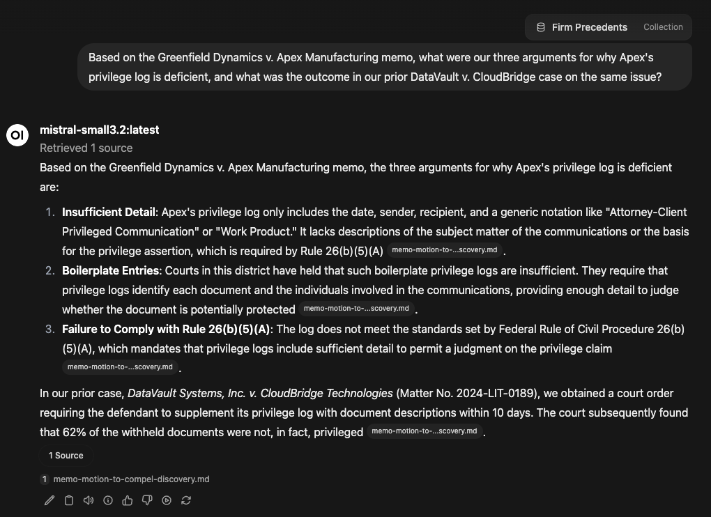
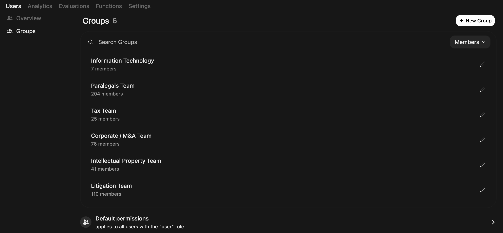
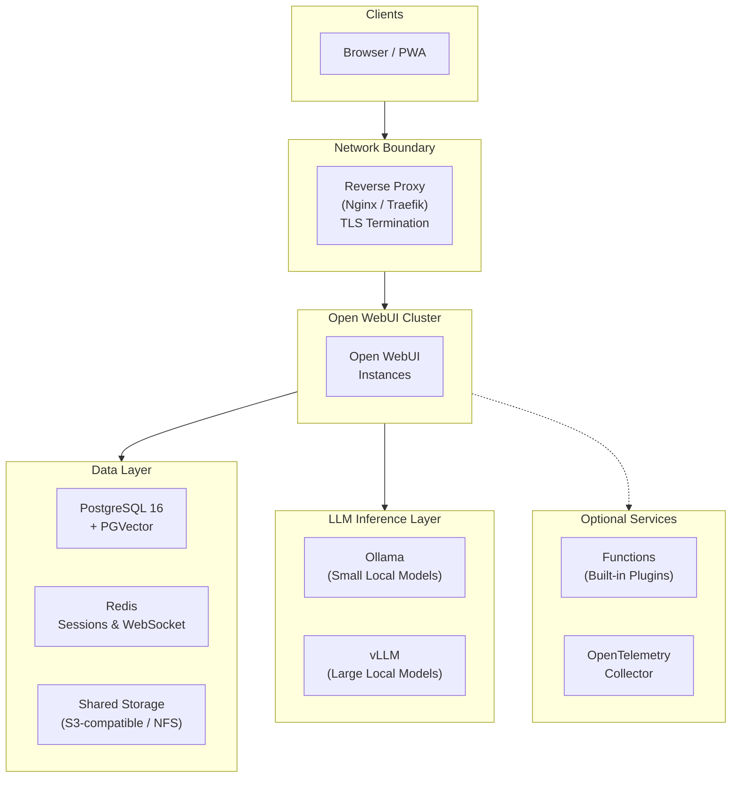

# Private AI for the Legal Industry

*For managing partners, CIOs, and legal technology leaders evaluating AI solutions for their firm.*

*This article is for informational purposes only and is not legal advice. Firms should evaluate AI deployments with counsel based on their jurisdiction, practice areas, and client obligations.*

<!-- TODO: Replace with hero image for social sharing previews -->

---

## The Problem

In 2023, a New York attorney submitted a brief citing six cases fabricated by ChatGPT. [The court sanctioned both the lawyer and his firm.](https://www.courtlistener.com/docket/63107798/54/mata-v-avianca-inc/) Since then, multiple bar associations have issued ethics guidance emphasizing that attorneys should verify AI-generated content, but verification without source traceability is difficult at scale.

That's just one of three challenges slowing AI adoption across the legal industry:

**Hallucinations are a liability.** AI-generated content that cites nonexistent cases or misrepresents holdings exposes firms to sanctions, malpractice claims, and reputational damage. Attorneys need traceability - the ability to verify every claim against a source document.

**Client data in hosted models can create privilege and confidentiality risk.** Sending case materials to cloud AI providers can raise concerns about waiver of attorney-client privilege under [ABA Model Rule 1.6](https://www.americanbar.org/news/abanews/aba-news-archives/2024/07/aba-issues-first-ethics-guidance-ai-tools/). While some ethics opinions (e.g., [ABA Formal Opinion 477R](https://docs.tbpr.org/pub/aba%20formal%20opinion%20477.authcheckdam.pdf)) suggest cloud use can be permissible with adequate safeguards, many firms handling sensitive litigation, M&A, or regulatory matters prefer to reduce third-party data exposure where possible. Self-hosting can support a firm's privilege protection efforts, but it does not alone guarantee privilege - firms should consult ethics counsel on their specific obligations.

**Compliance requirements are multiplying.** State bar AI disclosure rules, GDPR for international practices, and internal governance obligations often require auditable, controllable AI infrastructure rather than opaque data handling.

These challenges share a common root: firms need AI they can *control*, *observe*, and *validate* - not just *consume*.

---

## What a Legal AI Platform Needs

There's no shortage of legal AI products on the market - many are polished, well-funded, and easy to adopt. The strategic question is control: where data is processed, who can access it, and how confidently you can prove that to clients, courts, and regulators. For routine work with low-sensitivity data, shared infrastructure may be a reasonable tradeoff. For firms handling privileged litigation, regulatory investigations, or M&A due diligence, tighter control is often worth it.

Self-hosting can provide a level of direct operational control that many SaaS products do not: the ability to inspect and validate how data is handled in your own environment. Here's what that looks like in practice, and how [Open WebUI](https://docs.openwebui.com/), a self-hosted AI platform, supports it:

- **Keep sensitive workflows inside firm-controlled infrastructure.** Open WebUI can run on your infrastructure (on-premise, private cloud, or air-gapped). With the right configuration, firms can reduce third-party data exposure, limit model training risk, and avoid external API calls for inference.

- **Ground outputs in your own documents.** Attorneys can query the firm's briefs, precedents, statutes, and internal memos, then receive responses with inline citations and relevance scores. This does not eliminate hallucination, but it can significantly improve traceability for verification workflows. **All AI-generated content must be reviewed and verified by qualified attorneys before reliance or use in any legal proceeding.**

- **Map access controls to how your firm actually works.** Role-based permissions can map to practice groups. Application-level administrators can be restricted from viewing certain conversations, while model access, document access, and feature access are controlled per group.

- **Build auditability into daily use.** When configured as described in our [Technical Setup Guide](setup.md), chat retention controls, configurable logging, SSO integration, and restrictions on chat deletion can support your firm's governance and audit requirements.

### What This Looks Like in Practice

When configured with a firm's internal document library, an associate preparing a motion types a question into Open WebUI. The response can draw from the firm's briefs and cite the specific documents used, with relevance scores for each source. The associate clicks through to verify each citation against the original. The conversation can be logged under their user account for search and audit workflows. In deployments configured for internal-only processing, data can remain on firm-controlled systems.

For a partner reviewing the associate's work, the audit trail can show which AI-generated content was used, what sources it was grounded in, and when. That level of traceability is increasingly emphasized in ethics guidance and internal AI governance.

---

## Access Control for Practice Groups

Open WebUI's group system maps naturally to law firm organizational structures. Each practice group gets tailored permissions:

| Practice Group | AI Capabilities | Knowledge Bases | Special Permissions |
|---|---|---|---|
| **Litigation** | Full | Case law, motions, discovery templates | Web search enabled |
| **Corporate / M&A** | Full | Deal templates, regulatory filings, due diligence checklists | Document extraction *(extract structured data from contracts and filings)* |
| **Intellectual Property** | Full | Patent databases, prosecution templates | Code interpreter *(run analysis scripts on patent claim data)* |
| **Tax** | Advanced analysis only | Tax code, IRS guidance, firm tax opinions | RAG-only mode *(responses limited to firm documents, no general knowledge)* |
| **Paralegals / Staff** | Basic tasks only | Firm procedures, HR policies | No file upload, no web search |

Groups can synchronize with your identity provider (Okta, Azure AD, Google Workspace) via OAuth, so practice group membership can stay aligned with your firm's directory.

---

## What a Production Deployment Looks Like

*This section is a reference for your IT or engineering team. If you're evaluating Open WebUI at a strategic level, the key takeaway is simple: it can run on your existing infrastructure (VMware, Azure, AWS, or bare metal), scale with your firm, and be deployed with minimal external dependencies.*

For large firms (200–1,000+ attorneys), a production deployment needs high availability, data isolation, and compliance-ready infrastructure. Here's the reference architecture - for full deployment instructions, see the **[Technical Setup Guide](setup.md)**.

**Key design decisions:**
- **Stateless application nodes** - horizontal scaling allows capacity to flex with demand across the firm
- **Inference can run locally** - via Ollama (lightweight models) and vLLM (large models with GPU optimization), so prompts can stay on-network when configured accordingly
- **Unified data layer** - PostgreSQL handles both application data and vector search, reducing operational complexity
- **Redis session coordination** - enables multi-node deployments where any instance can serve any request seamlessly

---

## Get Started

Open WebUI is **free to use**. Infrastructure costs depend on your firm's scale: a single practice group pilot may run on one GPU server in your existing cloud environment or on-premise, while the full production architecture above involves dedicated compute and storage. In most environments, a pilot can be running very quickly, while a production rollout is typically a multi-week program covering security review, governance controls, and integration work.

The complete Docker Compose stack, security hardening checklist, RBAC configuration guide, and backup strategy are in our companion technical guide:

**[Legal Industry Technical Setup Guide →](setup.md)**

### Enterprise Support

If your firm wants hands-on support, [Open WebUI Enterprise](https://docs.openwebui.com/enterprise/) is available for teams that prefer not to go it alone:

- **Security & compliance guidance** - guidance on deploying Open WebUI in alignment with SOC 2, HIPAA, GDPR, FedRAMP, and ISO 27001 frameworks *(compliance determination remains the firm's responsibility)*
- **White-label branding** - Match the AI interface to your firm's identity
- **Dedicated support & SLAs** - Direct engineering access for architecture review and incident response

Your data, your infrastructure, your choice of models - with Open WebUI.

*Note: Open WebUI can support legal and compliance workflows, but no software alone establishes legal compliance. Firms should validate controls, policies, and use cases with qualified legal and security teams.*

**[Learn more about Enterprise → sales@openwebui.com](mailto:sales@openwebui.com)**

---

### Disclaimer

*Open WebUI is a general-purpose AI platform, not a legal technology product validated for any specific regulatory or ethical standard. All compliance determinations - including attorney-client privilege, bar ethics obligations, data protection regulations, and any other applicable framework - are the sole responsibility of the deploying firm. AI-generated content is not legal advice and is not a substitute for professional legal judgment. All AI outputs must be reviewed and verified by qualified attorneys before use.*

---

*Open WebUI is free to use and self-hostable. It powers AI deployments at organizations ranging from small teams to Fortune 500 companies. [See who's using Open WebUI →](https://docs.openwebui.com/enterprise/customers/)*