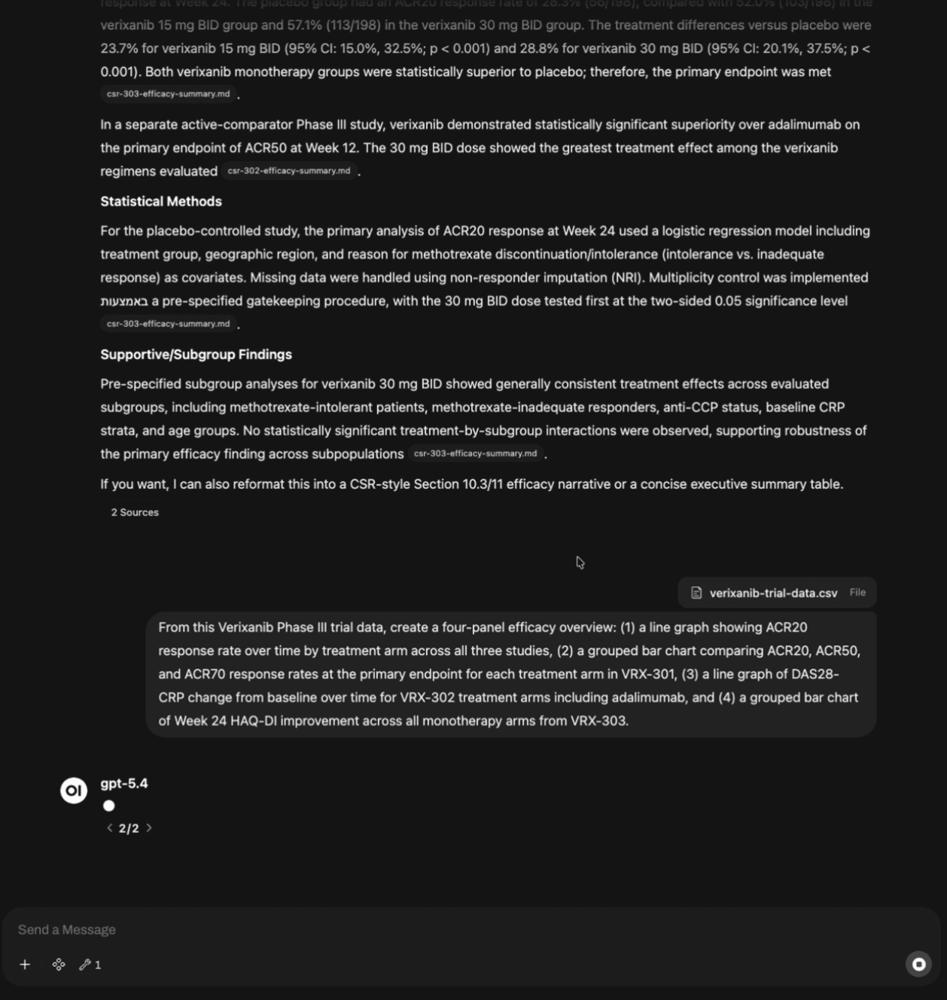
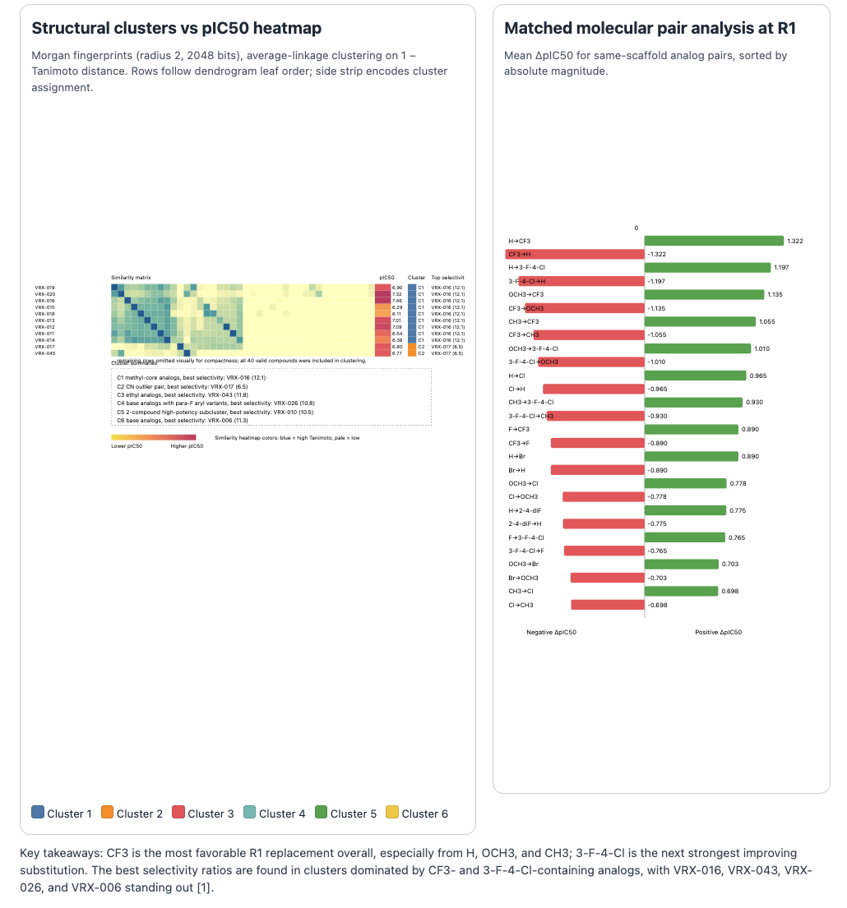
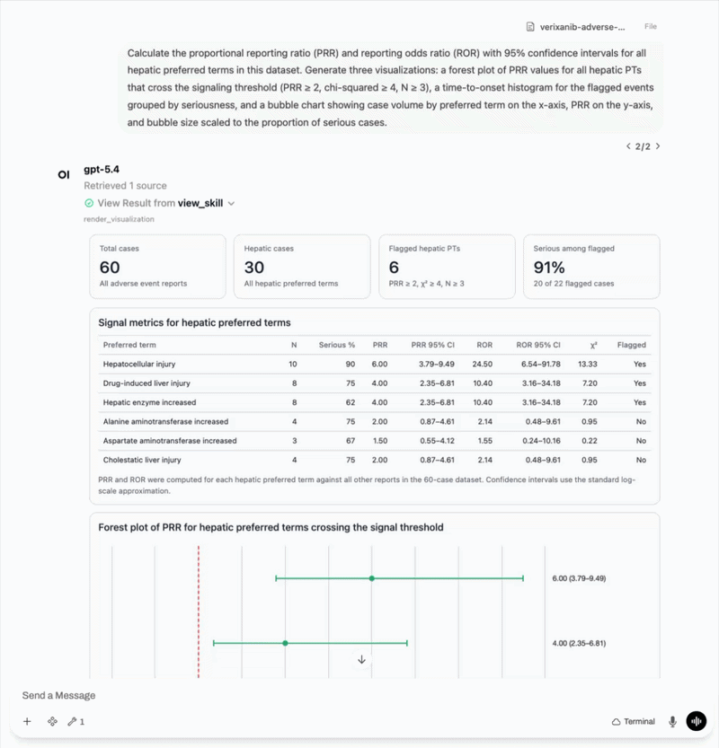
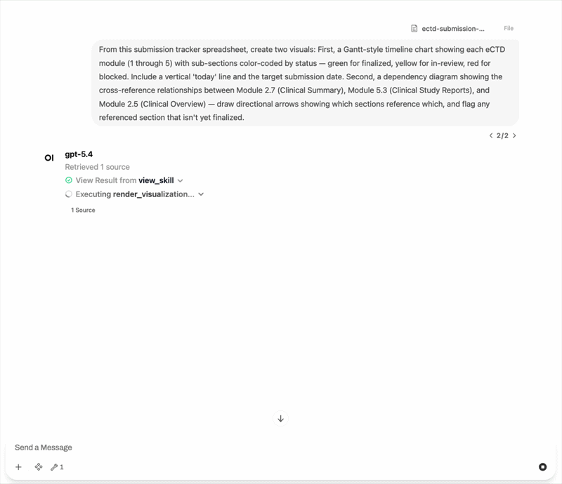
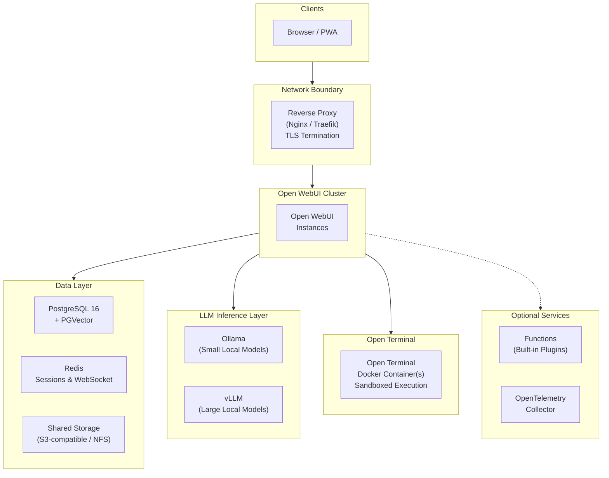

# What Would It Take for a Pharma Company to Run AI In-House?

*For R&D leaders, CIOs, and digital transformation executives evaluating AI solutions for their organization.*

*This article is for informational purposes only and does not constitute regulatory, legal, or compliance advice. Organizations should evaluate AI deployments with qualified counsel based on their regulatory environment, therapeutic areas, and data governance obligations.*

---

## Why This Question Matters Now

According to a Mordor Intelligence estimate, the pharmaceutical industry's AI market is [projected to reach $25.7 billion by 2030](https://www.mordorintelligence.com/industry-reports/artificial-intelligence-in-pharmaceutical-market), up from roughly $4 billion at the time of that analysis. Stanford's 2025 AI Index [estimated more than $250 billion](https://hai.stanford.edu/ai-index/2025-ai-index-report/economy) in AI investment across all sectors. Yet amid this surge, medicine makers have yet to see substantially shorter development timelines or meaningful improvements in clinical success rates. The gap isn't whether to adopt AI, but how it can be adopted effectively.

The numbers reveal the disconnect. A 2024 Kiteworks study reported that [**83% of pharmaceutical companies operate without automated safeguards**](https://www.contractpharma.com/exclusives/ai-data-security-the-83-compliance-gap-facing-pharmaceutical-companies/) to prevent sensitive data from leaking through AI tools. Only 17% have implemented technical controls like DLP scanning. The rest rely on training emails (40%), warnings without follow-up (20%), or have no AI usage policy at all (13%). McKinsey's [State of AI report](https://www.mckinsey.com/capabilities/quantumblack/our-insights/the-state-of-ai-how-organizations-are-rewiring-to-capture-value) reported that 47% of organizations using generative AI have already experienced at least one negative consequence, with cybersecurity leading the list. Meanwhile, companies that simply [bolt AI onto existing workflows](https://www.mckinsey.com/industries/life-sciences/our-insights/the-synthesis/how-pharma-is-rewriting-the-ai-playbook-perspectives-from-industry-leaders) are having trouble capturing meaningful value.

That backdrop is pushing some pharma companies to ask a more fundamental question: rather than relying solely on third-party AI platforms, **what would it take to run AI internally**? Four challenges are driving the conversation:

**The data you most want AI to analyze is the data you can least afford to expose.** Pre-IND compound structures, unpublished mechanism-of-action data, clinical endpoint designs, and manufacturing process parameters, for example, make up the intellectual property that underpins your pipeline. Sending it to a cloud LLM means relinquishing control. Even with contractual protections, once data hits a third-party API, you cannot fully guarantee how it's stored, cached, or used for model improvement. For organizations where a single patent filing depends on maintaining trade secret protection, that trade-off can be difficult to accept.

**Regulated workflows demand validated, auditable systems.** If a scientist uses an LLM to draft a clinical study report section, summarize adverse events, or review CMC documentation, the tool that produced that output may come under scrutiny similar to any computerized system, depending on the intended use and the organization's regulatory framework. Regulators expect electronic records with audit trails, access controls, and attributable authorship. A SaaS chatbot that can't tell you who asked what, when, or what sources informed the answer raises questions under those expectations.

**Scientific hallucinations compound through the pipeline.** When an AI fabricates a drug-drug interaction, misattributes a clinical outcome to the wrong study arm, or cites a retracted paper, the consequences aren't just embarrassing. They can contaminate safety assessments, mislead regulatory reviewers, and delay or derail programs worth hundreds of millions. Scientists need every AI-generated claim traceable to a source document they can verify themselves.

**Scientists who need computational AI the most can't always access it.** Drug discovery, clinical biostatistics, and pharmacometrics increasingly depend on computational workflows in order to run analyses, generate visualizations, and fit models. But according to a Tracekey report, [30% of IT-related positions in pharmaceutical companies remain unfilled](https://www.tracekey.com/en/skills-shortage-in-pharma/) in key markets, and the scientists with deep domain expertise are rarely the ones writing Python scripts. Industry commentators have described the need for ["trilingualism"](https://www.mckinsey.com/industries/life-sciences/our-insights/the-synthesis/how-pharma-is-rewriting-the-ai-playbook-perspectives-from-industry-leaders) — proficiency in data science, domain science, and business strategy — but acknowledge that finding people with all three is rare. The result is computational capability bottlenecks at the IT team, and scientists waiting in queue instead of iterating on analyses.

These challenges are leading some pharma companies to ask whether AI they can *control*, *validate*, *audit*, and *put directly in scientists' hands* might be worth exploring, instead of relying solely on third-party platforms.

---

## What Self-Hosted AI Would Actually Require

Every major cloud provider and a growing roster of startups now offer some flavor of "AI for life sciences." Most follow the same playbook: upload your data, call their API, get results. When the stakes are low (for tasks like summarizing published literature, drafting internal comms, or triaging help-desk tickets), that might be fine. But the moment the work touches a compound patent strategy, an IND-enabling dataset, or a safety signal trending toward a regulatory action, the risk of relying on a third party increases. The question stops being *"can we use AI?"* and becomes *"can we prove — to an inspector, an auditor, a partner in a licensing negotiation — exactly where this output came from, who saw the underlying data, and that none of it left our control?"*

That's why the conversation in pharma has moved past feature checklists. When organizations start evaluating self-hosted AI seriously, the requirements tend to cluster around five areas:

- **Data locality.** The ability to run AI entirely on company-controlled infrastructure, whether it's an on-premise data center, private cloud, or air-gapped environment. With the right configuration, this can reduce third-party data exposure, limit model training risk, and avoid external API calls for inference.

- **Source-grounded responses with citations.** The ability for scientists to query their internal company documents — SOPs, study protocols, regulatory guidance, literature databases, pharmacopeia references — and receive responses with inline citations and relevance scores. This does not eliminate hallucination, but it can improve traceability for verification workflows. **All AI-generated content must be reviewed and verified by qualified scientists before reliance or use in any regulatory submission.**

- **Group-based access control.** The ability to map role-based permissions to functional groups (R&D, Clinical, Regulatory, Pharmacovigilance, Manufacturing, Medical Affairs), restrict administrators from viewing certain conversations in the chat interface, and control model access, document access, and feature access per group.

- **Configurable audit and retention controls.** Conversation logging, configurable retention, SSO integration, and restrictions on chat deletion that can support an organization's compliance and audit requirements, including the kind of electronic records regulators expect in validated environments.

- **Computational capabilities accessible through natural language.** The ability for scientists to run real code — Python, R, Julia — through conversational prompts, in sandboxed environments on internal infrastructure, without requiring programming expertise or IT tickets. This can help bridge the gap between domain scientists and the computational workflows they need.

These aren't unique to any one product, but they are the criteria that organizations exploring self-hosted AI tend to evaluate against.

---

## One Approach: Open-Source Self-Hosting

[Open WebUI](https://docs.openwebui.com/) is a general-purpose, open-source AI platform that can be self-hosted. It's one example of a platform that can be configured to address the requirements above — organizations should evaluate whether and how its capabilities fit their own compliance and governance requirements.

### Illustrative Examples

> **Note:** The following scenarios are illustrative and do not represent validated or endorsed workflows. All drug names, compound data, study identifiers, and clinical results in these scenarios are entirely fictional and created solely for illustration. Organizations must design, test, and validate their own AI workflows according to their regulatory and governance requirements.

#### Querying Internal Documents with Source Citations

A regulatory affairs scientist is preparing a Module 2.7 clinical summary for an eCTD submission. She opens Open WebUI, configured with the company's internal document library, and queries: *"Summarize the primary efficacy endpoints from our Phase III trials for compound X, including the statistical methods used."* The response can draw from internal clinical study reports, can cite each by document name with relevance scores, and can structure the summary in a format consistent with ICH E3 guidelines. She clicks each citation to verify it against the source PDF. The conversation can be logged under her SSO identity for search and audit workflows.

Two weeks later, during an internal pre-submission readiness review, a colleague asks how a specific claim in the summary was generated. The QA team can pull up the audit trail: the exact query, the AI response, the source documents cited, and the timestamp — all attributable to a named user, all retained on company-controlled infrastructure. That level of traceability is increasingly emphasized in regulatory guidance.

#### Visualizing Clinical Trial Data with Open Terminal

The example above shows how Open WebUI can ground responses in source documents — the scientist asks a question, and the AI pulls from the company's CSRs to produce a cited summary. But text summaries may not be sufficient for all use cases. When that same scientist needs to present the Verixanib efficacy data to a cross-functional team ahead of a data monitoring committee meeting, she needs visuals — and she needs them built from the same underlying trial data, not recreated manually.

[Open Terminal](https://docs.openwebui.com/features/extensibility/open-terminal) is a sandboxed computing environment built into Open WebUI. Instead of writing code, a scientist provides the relevant data, and describes an analysis in plain language. The AI writes and executes code inside an isolated Docker container on the organization's infrastructure — complete with scientific libraries — and returns the results directly in the chat. The file browser lets scientists upload datasets, preview outputs, and download finished artifacts without ever leaving the interface.

She switches to an Open Terminal session, attaches the consolidated Verixanib efficacy dataset from the company's Knowledge collection — data corresponding to the CSRs she just queried — and types:

*"From this Verixanib Phase III trial data, create a four-panel efficacy overview: (1) a line graph showing ACR20 response rate over time by treatment arm across all three studies, (2) a grouped bar chart comparing ACR20, ACR50, and ACR70 response rates at the primary endpoint for each treatment arm in VRX-301, (3) a line graph of DAS28-CRP change from baseline over time for VRX-302 treatment arms including an active comparator, and (4) a grouped bar chart of Week 24 HAQ-DI improvement across all monotherapy arms from VRX-303."*

The AI can read the dataset, generate the four-panel figure, and return it in the chat. She reviews the output, asks for a color adjustment to match the company's slide template, and can download the final figure — all within the same conversation, all on the same infrastructure where the source CSRs live.

#### SAR Visualization in Drug Discovery

A medicinal chemist is deep in lead optimization. His team has synthesized 200+ analogs of a kinase inhibitor scaffold, and the SAR is getting complex — potency cliffs appear when certain R-groups are swapped, but the team hasn't yet mapped the full landscape systematically. He references a compound library CSV (SMILES strings, IC50 values, selectivity ratios, and physicochemical descriptors) from Knowledge, enables Open Terminal, and types:

*"Using RDKit: compute Morgan fingerprints for these compounds, cluster them by Tanimoto similarity, and generate a heatmap showing the relationship between structural clusters and pIC50. Annotate the cluster with the best selectivity ratio. Add a second panel showing a matched molecular pair analysis for substitutions at the R1 position — plot the ΔpIC50 for each transformation as a horizontal bar chart, sorted by magnitude."*

The AI can install RDKit and scikit-learn, calculate fingerprints, run the clustering, identify the matched pairs, and produce a two-panel figure: the SAR heatmap on top, the matched molecular pair bar chart below. The chemist spots a potential pattern — a fluorine-to-chlorine swap at R1 appears to boost potency by ~0.5 log units without killing selectivity — and sends the figure to the project team with a follow-up synthesis proposal for experimental validation.

Industry leaders have described this iterative approach — the model predicts, the scientist validates, and both improve — as a [virtuous cycle](https://www.mckinsey.com/industries/life-sciences/our-insights/the-synthesis/how-pharma-is-rewriting-the-ai-playbook-perspectives-from-industry-leaders). Open Terminal can make that cycle more accessible to scientists who can describe what they need in natural language.

#### Detecting Safety Signals in Pharmacovigilance Data

A pharmacovigilance scientist is running a routine disproportionality screen on the company's adverse event database. A new signal has appeared for a marketed product — a cluster of hepatic events that wasn't flagged in the clinical program. She needs to characterize it before the next PSMF update. She exports the case-level data (MedDRA preferred terms, time-to-onset, seriousness criteria, reporter type, and co-suspect medications) from the safety database, uploads the CSV to Open Terminal, and types:

*"Calculate the proportional reporting ratio (PRR) and reporting odds ratio (ROR) with 95% confidence intervals for all hepatic preferred terms in this dataset. Generate three visualizations: a forest plot of PRR values for all hepatic PTs that cross the signaling threshold (PRR ≥ 2, chi-squared ≥ 4, N ≥ 3), a time-to-onset histogram for the flagged events grouped by seriousness, and a bubble chart showing case volume by preferred term on the x-axis, PRR on the y-axis, and bubble size scaled to the proportion of serious cases."*

The AI can process the dataset, run the statistical calculations, and return three figures. The forest plot shows that three hepatic PTs appear to exceed the signaling threshold. The time-to-onset histogram shows a concentration in the first 90 days — a pattern the scientist can evaluate further as part of the signal assessment. The bubble chart gives the scientist an at-a-glance view of which terms carry the most signal weight. She downloads the figures, attaches them to a signal evaluation report, and has a preliminary assessment ready for the safety committee — reducing the iteration time between the pharmacovigilance scientist and the computational analysis.

#### Building Regulatory Submission Visuals

A regulatory operations lead is coordinating a rolling NDA submission. The publishing team needs a clear visual for internal stakeholders showing the submission architecture — which eCTD modules are complete, which are in review, which are blocked on pending data, and how the cross-references between sections are structured. He opens Open Terminal and types:

*"From this submission tracker spreadsheet, create two visuals: First, a Gantt-style timeline chart showing each eCTD module (1 through 5) with sub-sections color-coded by status — green for finalized, yellow for in-review, red for blocked. Include a vertical 'today' line and the target submission date. Second, a dependency diagram showing the cross-reference relationships between Module 2.7 (Clinical Summary), Module 5.3 (Clinical Study Reports), and Module 2.5 (Clinical Overview) — draw directional arrows showing which sections reference which, and flag any referenced section that isn't yet finalized."*

The AI can parse the spreadsheet, generate a color-coded Gantt chart overlaid with milestone markers and a dependency graph with red-flagged nodes for incomplete cross-references. The regulatory lead can see that Module 2.7 references three Module 5.3 study reports that are still in QC — a dependency that may not have been as visible in the flat tracker. He shares the visuals in the publishing team's next standup, and they reprioritize QC accordingly.

---

## What Access Control Could Look Like

Open WebUI includes a group-based access control system. The table below shows one example of how a pharma company might map functional groups to AI capabilities. **This is an illustrative configuration — organizations should design their own group structure based on their specific needs, risk tolerance, and governance requirements.**

| Functional Group | AI Capabilities | Knowledge Bases | Special Permissions |
|---|---|---|---|
| **Biostatistics** | Full | Analysis datasets, statistical analysis plans, CDISC standards libraries | Open Terminal *(survival analysis, enrollment dashboards, forest plots)*, code interpreter |
| **Clinical Development** | Full | Study protocols, investigator brochures, CRF templates, monitoring plan libraries | Document extraction *(structured data from regulatory letters)*, web search enabled |
| **Manufacturing / CMC** | Full | Batch records, process validation reports, equipment SOPs | Open Terminal *(batch trend analysis, process parameter visualization)*, file upload |
| **Medical Affairs** | Full | Product monographs, congress abstracts, KOL slide decks | Web search enabled |
| **Pharmacovigilance** | Advanced analysis only | MedDRA dictionaries, CIOMS forms, signal detection SOPs | RAG-only mode *(responses grounded in curated internal source documents)* |
| **R&D / Discovery** | Full | Compound libraries, assay protocols, literature databases | Open Terminal *(SAR analysis, molecular modeling, visualization)*, code interpreter |
| **Regulatory Affairs** | Full | eCTD templates, FDA/EMA guidance, precedent correspondence | Document extraction *(structured data from regulatory letters)* |
| **Support Staff** | Basic tasks only | Company policies, HR procedures, training materials | No file upload, no web search, no terminal access |

Groups can synchronize with your identity provider (Okta, Azure AD, Ping Identity) via OAuth, so functional group membership can stay aligned with your organization's directory.

---

## What Infrastructure Is Involved

*This section is a reference for your IT or infrastructure team. If you're evaluating at a strategic level, the key takeaway is simple: a self-hosted AI platform can run on existing infrastructure (VMware, Azure, AWS, or bare metal), scale with the organization, and be deployed with minimal external dependencies.*

For large pharma organizations (500–10,000+ employees), a production deployment typically requires high availability, data isolation, and infrastructure that can support regulatory requirements. Here's a reference architecture using Open WebUI — for full deployment instructions, see the **[Technical Setup Guide](setup.md)**.

**Key design decisions:**
- **Stateless application nodes** — horizontal scaling allows capacity to flex with demand across the organization
- **Inference can run locally** — via Ollama (lightweight models) and vLLM (large models with GPU optimization), so prompts can stay on-network when configured accordingly
- **Unified data layer** — PostgreSQL handles both application data and vector search, reducing operational complexity
- **Redis session coordination** — enables multi-node deployments where any instance can serve any request seamlessly
- **Sandboxed Open Terminal containers** — each terminal runs in an isolated Docker container with resource limits enforced; scientists get a full computing environment while IT maintains control

---

## Considerations Before Getting Started

Self-hosting AI is not trivial. Before committing, organizations should consider:

- **Infrastructure costs.** Open WebUI itself is free, but GPU servers, storage, and networking are not. A single-department pilot may run on one GPU server; an organization-wide deployment involves dedicated compute and storage.
- **Governance design.** Who approves AI use cases? How are outputs reviewed? What's the policy for AI-assisted work product in regulatory submissions? These questions matter more than the technology.
- **Validation and testing.** Any AI deployment in a regulated environment should go through appropriate validation, security review, and integration testing before production use. This is typically a multi-week program.
- **Ongoing maintenance.** Model updates, security patches, user support, and knowledge base curation are ongoing responsibilities.

For organizations that want to explore the technical details, the complete Docker Compose stack (including Open Terminal configuration), security hardening checklist, RBAC configuration guide, and backup strategy are in our companion guide:

**[Technical Setup Guide →](setup.md)**

For organizations that want deployment guidance, [Open WebUI Enterprise](https://docs.openwebui.com/enterprise/) offers hands-on support including regulatory alignment guidance *(compliance determination remains the organization's responsibility)*, white-label branding, and dedicated SLAs.

*Note: No software alone establishes regulatory compliance. Organizations should validate controls, policies, and use cases with qualified regulatory, legal, and security teams.*

**[Learn more about Enterprise → sales@openwebui.com](mailto:sales@openwebui.com)**

---

### Disclaimer

*Open WebUI is a general-purpose AI platform, not a pharmaceutical or life sciences product validated for any specific regulatory standard (including GxP, 21 CFR Part 11, EU Annex 11, or ICH guidelines). All compliance determinations — including computerized system validation, data integrity, electronic records requirements, and any other applicable regulatory framework — are the sole responsibility of the deploying organization. AI-generated content is not scientific, medical, or regulatory advice and is not a substitute for qualified professional judgment. All AI outputs must be reviewed and verified by qualified scientists before use in any regulated context.*

---
