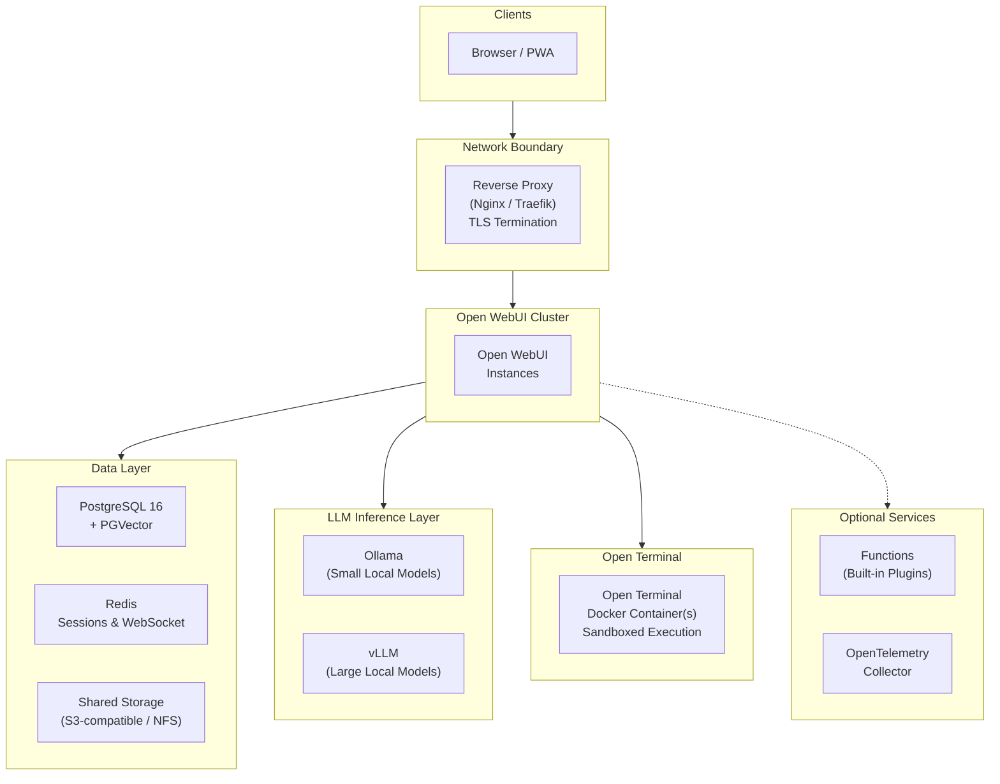

# Private AI for the Pharmaceutical Industry

*For R&D leaders, CIOs, and digital transformation executives evaluating AI solutions for their organization.*

<!-- TODO: Replace with hero image for social sharing previews -->

---

## The Problem

The pharmaceutical industry's AI market is [projected to reach $25.7 billion by 2030](https://www.mordorintelligence.com/industry-reports/artificial-intelligence-in-pharmaceutical-market), up from roughly $4 billion today. Companies [invested more than $250 billion](https://hai.stanford.edu/ai-index/2025-ai-index-report/economy) in AI last year across all sectors. Yet amid this surge, medicine makers have yet to see substantially shorter development timelines or meaningful improvements in preclinical or clinical success rates. The gap isn't whether to adopt AI — it's *how*.

The numbers reveal the disconnect. A 2024 Kiteworks study found that [**83% of pharmaceutical companies operate without automated safeguards**](https://www.contractpharma.com/exclusives/ai-data-security-the-83-compliance-gap-facing-pharmaceutical-companies/) to prevent sensitive data from leaking through AI tools. Only 17% have implemented technical controls like DLP scanning. The rest rely on training emails (40%), warnings without follow-up (20%), or have no AI usage policy at all (13%). Meanwhile, 27% of life sciences organizations report that over 30% of their AI-handled data contains sensitive or proprietary content. McKinsey's [State of AI report](https://www.mckinsey.com/capabilities/quantumblack/our-insights/the-state-of-ai-how-organizations-are-rewiring-to-capture-value) found that 47% of organizations using generative AI have already experienced at least one negative consequence, with cybersecurity leading the list.

Pharma companies that simply [bolt AI onto existing workflows](https://www.mckinsey.com/industries/life-sciences/our-insights/the-synthesis/how-pharma-is-rewriting-the-ai-playbook-perspectives-from-industry-leaders) — the "tinkerers," as McKinsey calls them — won't capture meaningful value. The companies that will are the ones that redesign their infrastructure to make AI a controlled, validated part of how they work. Four specific challenges explain why:

**The data you most want AI to analyze is the data you can least afford to expose.** Pre-IND compound structures, unpublished mechanism-of-action data, clinical endpoint designs, manufacturing process parameters — this is the intellectual property that underpins your pipeline. Sending it to a cloud LLM means relinquishing physical control. Even with contractual protections, once data hits a third-party API, you cannot guarantee how it's stored, cached, or used for model improvement. For organizations where a single patent filing depends on maintaining trade secret protection, that's not a manageable risk — it's a disqualifying one.

**Regulated workflows demand validated, auditable systems.** AI isn't exempt from GxP. If a scientist uses an LLM to draft a clinical study report section, summarize adverse events, or review CMC documentation, the tool that produced that output falls under the same scrutiny as any computerized system in a regulated environment. [FDA 21 CFR Part 11](https://www.ecfr.gov/current/title-21/chapter-I/subchapter-A/part-11) requires electronic records with audit trails, access controls, and attributable authorship. [EMA Annex 11](https://health.ec.europa.eu/system/files/2016-11/annex11_01-2011_en_0.pdf) imposes equivalent requirements. A SaaS chatbot that can't tell you who asked what, when, or what sources informed the answer doesn't meet that standard.

**Scientific hallucinations compound through the pipeline.** When an AI fabricates a drug-drug interaction, misattributes a clinical outcome to the wrong study arm, or cites a retracted paper, the consequences aren't just embarrassing — they can contaminate safety assessments, mislead regulatory reviewers, and delay or derail programs worth hundreds of millions. Scientists need every AI-generated claim traceable to a source document they can verify themselves.

**Scientists who need computational AI the most can't access it.** Drug discovery, clinical biostatistics, and pharmacometrics increasingly depend on computational workflows — running analyses, generating visualizations, fitting models. But [30% of IT-related positions in pharmaceutical companies remain unfilled](https://www.tracekey.com/en/skills-shortage-in-pharma/) in key markets, and the scientists with deep domain expertise are rarely the ones writing Python scripts. McKinsey's pharma leaders stress what J&J's Ashita Batavia calls ["trilingualism"](https://www.mckinsey.com/industries/life-sciences/our-insights/the-synthesis/how-pharma-is-rewriting-the-ai-playbook-perspectives-from-industry-leaders) — proficiency in data science, domain science, and business strategy — but acknowledge that finding people with all three is rare. The result: computational capability bottlenecks at the IT team, and scientists wait in queue instead of iterating on analyses.

The common thread: pharma needs AI infrastructure it can *deploy inside its own walls*, *validate against its own standards*, *audit with its own tools*, and *put directly in the hands of the scientists who do the work*.

---

## What a Pharma AI Platform Needs

The market is full of "AI for life sciences" products — polished, well-funded, and quick to deploy. Most of them work the same way: your data goes to their servers, their models process it, and you get results back. For low-sensitivity use cases like drafting internal emails or summarizing public literature, that model works fine. For anything touching your pipeline, your patients, or your regulators, it creates dependencies you can't fully control.

Self-hosting changes the equation. Instead of trusting vendor claims about data handling, you verify them by inspecting the infrastructure yourself. Here's what that looks like concretely — and how [Open WebUI](https://docs.openwebui.com/), a self-hosted AI platform, delivers it:

- **Zero data exfiltration by design.** Open WebUI runs entirely on your infrastructure — on-premise data center, validated private cloud, or air-gapped environment. Models run locally via Ollama or vLLM. No prompts, no completions, no embeddings ever leave your network. There is nothing to trust because there is nothing external.

- **Source-grounded responses for scientific rigor.** Scientists query internal document collections — SOPs, study protocols, regulatory guidance, literature databases, pharmacopeia references — and receive answers with inline citations and relevance scores. Each citation links back to the original document. This doesn't make hallucination impossible, but it makes every claim verifiable.

- **Organizational access control out of the box.** Permissions map to your functional structure: R&D, Clinical, Regulatory, Pharmacovigilance, Manufacturing, Medical Affairs. Each group sees only the models, documents, and capabilities assigned to it. IT administrators can manage the platform without ever viewing the content of scientific conversations.

- **A complete audit trail for every interaction.** Every conversation is timestamped, attributed to an authenticated user, and retained according to your policy. Users cannot delete or create unlogged conversations. Combined with SSO integration, this produces the kind of electronic record that GxP auditors expect to see.

- **A computational workbench scientists can use through natural language.** [Open Terminal](https://docs.openwebui.com/features/extensibility/open-terminal) gives the AI a full computing environment — not a sandboxed code snippet, but a real operating system where it can install libraries, run scripts in any language, process files, and return results. A biostatistician can say *"run a Kaplan-Meier analysis on this trial data"* and the AI executes real Python code with real scientific libraries, all inside an isolated Docker container on your infrastructure. No data leaves the network. No IT ticket required. The file browser built into the chat lets scientists upload datasets, preview outputs, and download results without switching tools.

### What This Looks Like in Practice

A regulatory affairs scientist is preparing a Module 2.7 clinical summary for an eCTD submission. She opens Open WebUI and queries the company's internal knowledge base: *"Summarize the primary efficacy endpoints from our Phase III trials for compound X, including the statistical methods used."* The response pulls from three internal clinical study reports, cites each by document name with relevance scores, and structures the summary in a format consistent with ICH E3 guidelines. She clicks each citation to verify it against the source PDF. The entire exchange is logged under her SSO identity.

Two weeks later, during an FDA pre-submission meeting, a reviewer asks how a specific claim in the summary was generated. The QA team pulls up the audit trail: the exact query, the AI response, the source documents cited, and the timestamp — all attributable to a named user, all retained on company-controlled infrastructure.

<!-- TODO: Replace with real screenshot of chat UI showing inline citations and source panel -->

### Visualizing Trial Results with Open Terminal

A clinical data scientist needs to analyze progression-free survival across treatment arms from a Phase III oncology trial. She opens Open WebUI, selects an Open Terminal instance from the terminal dropdown, and drags the trial dataset (a CSV export from the EDC system) into the file browser. Then she types:

*"Clean this dataset — standardize the date columns, flag any missing event indicators, and generate a Kaplan-Meier survival curve comparing the treatment and control arms. Include a log-rank test p-value and 95% confidence intervals. Save the figure as a publication-ready PDF."*

The AI reads the uploaded file, installs the necessary libraries (`lifelines`, `matplotlib`, `pandas`), writes and executes a Python script in the Docker-sandboxed terminal, and produces the survival curve. The scientist previews the chart directly in the file browser, clicks to download the PDF and the reproducible script. If she wants to adjust the visualization — change the color palette, add a number-at-risk table — she describes the change in plain language and the AI modifies and reruns the script.

The entire workflow happens inside the company's network. The trial data never touches an external API. The conversation, including the code that was executed and the files that were produced, is captured in the audit trail.

<!-- TODO: Replace with screenshot of Open Terminal file browser showing survival curve output -->

### Accelerating Drug Discovery in the Lab

A medicinal chemist in the discovery team is running a structure-activity relationship (SAR) analysis on a series of lead compounds. He uploads a compound library CSV — containing SMILES strings, IC50 values, and selectivity data — to the Open Terminal file browser and asks:

*"Compute molecular descriptors for these compounds using RDKit, cluster them by Tanimoto similarity, and generate a heatmap showing the relationship between structural clusters and potency. Highlight the cluster with the best selectivity profile."*

The AI installs RDKit and scikit-learn in the sandboxed environment, calculates fingerprints and descriptors, performs the clustering, and produces an annotated heatmap. The chemist reviews it in the file browser and follows up: *"Now plot a matched molecular pair analysis showing how the R-group substitutions at position 4 affect binding affinity."* The AI iterates — reading the previous results, running additional analysis, and returning updated visualizations.

This is what Genentech's John Marioni describes as a "lab-in-the-loop": the model predicts, the scientist validates, and both improve in a [virtuous cycle](https://www.mckinsey.com/industries/life-sciences/our-insights/the-synthesis/how-pharma-is-rewriting-the-ai-playbook-perspectives-from-industry-leaders). Open Terminal makes that cycle accessible to any scientist who can describe what they need in natural language — no programming expertise required.

<!-- TODO: Replace with screenshot of Open Terminal showing SAR heatmap visualization -->

---

## Access Control for Functional Groups

Pharma organizations don't have one relationship with AI — they have many. A medicinal chemist analyzing SAR data has different needs and risk tolerances than a pharmacovigilance officer reviewing safety signals. Open WebUI's group system lets you configure each function independently:

<!-- TODO: Replace with screenshot of Admin Panel → Groups showing functional groups -->

| Functional Group | AI Capabilities | Knowledge Bases | Special Permissions |
|---|---|---|---|
| **R&D / Discovery** | Full | Compound libraries, assay protocols, literature databases | Open Terminal *(SAR analysis, molecular modeling, visualization)*, code interpreter |
| **Clinical Operations** | Full | Study protocols, CRF templates, monitoring plan libraries | Open Terminal *(survival analysis, enrollment dashboards)*, web search enabled |
| **Regulatory Affairs** | Full | eCTD templates, FDA/EMA guidance, precedent correspondence | Document extraction *(structured data from regulatory letters)* |
| **Pharmacovigilance** | Advanced analysis only | MedDRA dictionaries, CIOMS forms, signal detection SOPs | RAG-only mode *(responses restricted to validated source documents)* |
| **Manufacturing / CMC** | Full | Batch records, process validation reports, equipment SOPs | Open Terminal *(batch trend analysis, process parameter visualization)*, file upload |
| **Medical Affairs** | Full | Product monographs, congress abstracts, KOL slide decks | Web search enabled |
| **Support Staff** | Basic tasks only | Company policies, HR procedures, training materials | No file upload, no web search, no terminal access |

Groups synchronize with your identity provider (Okta, Azure AD, Ping Identity) via OAuth, so when someone transfers between departments, their AI permissions update automatically on next login.

---

## Open WebUI Features That Enable Pharma Workflows

The scenarios above illustrate individual workflows, but the platform's value comes from how its capabilities combine. Here's how Open WebUI's feature set maps to the workflows pharma organizations need:

| Feature | Pharma Use Cases | Why It Matters |
|---|---|---|
| **[Open Terminal](https://docs.openwebui.com/features/extensibility/open-terminal)** | Trial data visualization, SAR analysis, batch trend analysis, biostatistics, pharmacometric modeling | Scientists run real code (Python, R, Julia) through natural language. Execution happens in a sandboxed Docker container on your infrastructure — no data leaves the network, no IT ticket required. |
| **[Knowledge / RAG](https://docs.openwebui.com/features/ai-knowledge/)** | Query SOPs, study protocols, regulatory guidance, pharmacopeia, internal literature | Source-grounded answers with inline citations and relevance scores. Every claim traces back to a validated source document. |
| **[Groups & Permissions](https://docs.openwebui.com/features/workspace/permissions/)** | Functional group access control (R&D, Clinical, Regulatory, PV, CMC, Medical Affairs) | Least-privilege access synced with your identity provider. Each group sees only the models, documents, and tools assigned to it. |
| **[Audit Logging](https://docs.openwebui.com/)** | 21 CFR Part 11, Annex 11, GxP computerized system validation | Immutable, timestamped, user-attributed records of every conversation, query, and response. |
| **[Model Management](https://docs.openwebui.com/features/workspace/models/)** | Different models for different risk profiles across functional groups | Deploy lightweight models for triage and summarization alongside large reasoning models for complex scientific analysis — all running locally. |
| **[Tools & Functions](https://docs.openwebui.com/features/extensibility/plugin/)** | Custom integrations with LIMS, ELN, CTMS, safety databases | Extend the platform with plugins that connect to your existing validated systems without exposing data to external services. |

---

## What a Production Deployment Looks Like

*This section is a reference for your IT or infrastructure team. If you're evaluating Open WebUI at a strategic level, the key takeaway is: it deploys on your existing infrastructure (VMware, Azure, AWS, or bare metal), scales horizontally, and has zero external dependencies once models are loaded.*

For large pharma organizations (500–10,000+ employees), a production deployment needs high availability, data isolation, and GxP-ready infrastructure. Here's the reference architecture — for full deployment instructions, see the **[Technical Setup Guide](setup.md)**.

**Key design decisions:**
- **Stateless application nodes** — scale out during submission sprints, scale back during quieter periods; lose any single node without service interruption
- **All inference runs locally** — via Ollama (lightweight models for triage and summarization) and vLLM (large reasoning models for complex scientific analysis); nothing leaves the network
- **Unified data layer** — PostgreSQL handles both the audit-trail database and vector search (via PGVector), so there's one system to back up, validate, and secure
- **Redis session coordination** — enables multi-node deployments where any instance can serve any user seamlessly, critical for organizations operating across time zones
- **Sandboxed Open Terminal containers** — each terminal runs in an isolated Docker container with resource limits (CPU, memory) enforced; scientists get a full computing environment while IT maintains control over what's installed and how much compute is consumed

---

## Get Started

Open WebUI is **free to use**. Infrastructure costs depend on your organization's scale — a single-department pilot can run on one GPU server in your existing environment, while the full production architecture above involves dedicated compute and storage. A pilot can typically be running within hours — with Open Terminal, a scientist can be visualizing trial data the same day. A full validated rollout takes a few weeks.

The complete Docker Compose stack (including Open Terminal configuration), security hardening checklist, RBAC configuration guide, and backup strategy are in our companion technical guide:

**[Pharma Industry Technical Setup Guide →](setup.md)**

### Enterprise Support

If your organization wants hands-on deployment support, [Open WebUI Enterprise](https://docs.openwebui.com/enterprise/) is available for teams that prefer not to go it alone:

- **Regulatory alignment guidance** — 21 CFR Part 11, Annex 11, HIPAA, SOC 2, ISO 27001
- **White-label branding** — Match the AI interface to your corporate identity
- **Dedicated support & SLAs** — Direct engineering access for architecture review and incident response

Your compounds, your protocols, your models — on your infrastructure.

**[Learn more about Enterprise → sales@openwebui.com](mailto:sales@openwebui.com)**

---

*Open WebUI is free to use and self-hostable. It powers AI deployments at organizations ranging from small research teams to Fortune 500 companies. [See who's using Open WebUI →](https://docs.openwebui.com/enterprise/customers/)*

---

### References

1. *"AI Data Security: The 83% Compliance Gap Facing Pharmaceutical Companies."* Contract Pharma / Kiteworks, 2024. [contractpharma.com](https://www.contractpharma.com/exclusives/ai-data-security-the-83-compliance-gap-facing-pharmaceutical-companies/)
2. *"How Pharma Is Rewriting the AI Playbook: Perspectives from Industry Leaders."* McKinsey & Company, 2025. [mckinsey.com](https://www.mckinsey.com/industries/life-sciences/our-insights/the-synthesis/how-pharma-is-rewriting-the-ai-playbook-perspectives-from-industry-leaders)
3. *"The State of AI: How Organizations Are Rewiring to Capture Value."* McKinsey & Company. [mckinsey.com](https://www.mckinsey.com/capabilities/quantumblack/our-insights/the-state-of-ai-how-organizations-are-rewiring-to-capture-value)
4. *"AI in Pharma: Use Cases, Success Stories, and Challenges."* SCW.AI, 2026. [scw.ai](https://scw.ai/blog/ai-in-pharma/)
5. *21 CFR Part 11 — Electronic Records; Electronic Signatures.* U.S. Food & Drug Administration. [ecfr.gov](https://www.ecfr.gov/current/title-21/chapter-I/subchapter-A/part-11)
6. *Annex 11: Computerised Systems.* European Commission, EudraLex Volume 4. [health.ec.europa.eu](https://health.ec.europa.eu/system/files/2016-11/annex11_01-2011_en_0.pdf)
7. *Open Terminal Documentation.* Open WebUI. [docs.openwebui.com](https://docs.openwebui.com/features/extensibility/open-terminal)
