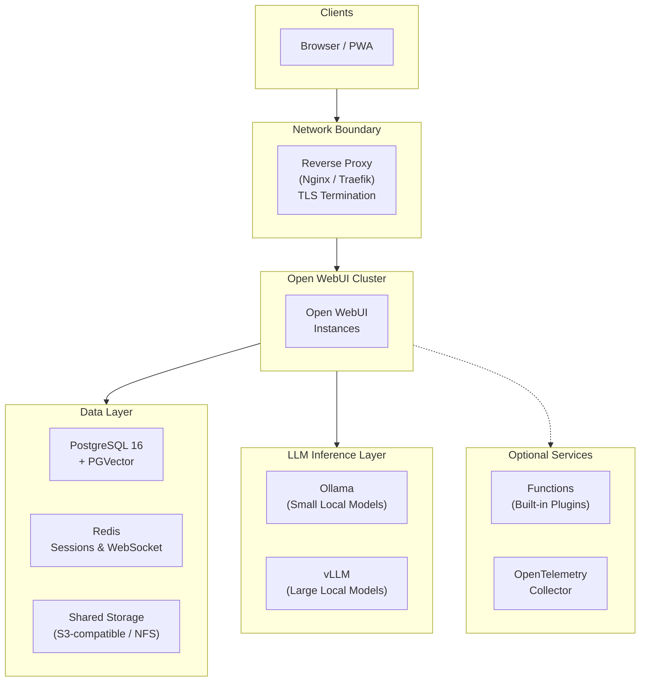

# What Would It Take for a Pharma Company to Run AI On Its Own Infrastructure?

*For R&D leaders, CIOs, and digital transformation executives evaluating AI solutions for their organization.*

*This article is for informational purposes only and does not constitute regulatory, legal, or compliance advice. Organizations should evaluate AI deployments with qualified professionals based on their specific regulatory obligations and risk profile.*

<!-- TODO: Replace with hero image for social sharing previews -->

---

## Why This Question Matters Now

In 2023, Samsung [banned employees from using ChatGPT](https://mashable.com/article/samsung-chatgpt-leak-leads-to-employee-ban) after engineers inadvertently uploaded proprietary source code and internal meeting notes to the service - data that could be stored on external servers and potentially used for model training. Samsung wasn't a pharma company, but the lesson landed hard across the industry: if it can happen with source code, it can happen with compound structures, clinical trial data, and manufacturing processes.

The pharma industry took notice - and the numbers confirm why. A 2024 Kiteworks study found that [**83% of pharmaceutical companies operate without automated safeguards**](https://www.contractpharma.com/exclusives/ai-data-security-the-83-compliance-gap-facing-pharmaceutical-companies/) to prevent sensitive data from leaking through AI tools. Only 17% have implemented technical controls like DLP scanning. The rest rely on training emails (40%), warnings without follow-up (20%), or have no AI usage policy at all (13%). Meanwhile, 27% of life sciences organizations report that over 30% of their AI-handled data contains sensitive or proprietary content.

Three specific challenges are slowing AI adoption:

**The data you most want AI to analyze is the data you can least afford to expose.** Pre-IND compound structures, unpublished mechanism-of-action data, clinical endpoint designs, manufacturing process parameters - this is the intellectual property that underpins your pipeline. Sending it to a cloud LLM means relinquishing physical control. Even with contractual protections, once data hits a third-party API, you cannot guarantee how it's stored, cached, or used for model improvement. For organizations where a single patent filing depends on maintaining trade secret protection, that risk may be difficult to accept.

**Regulated workflows demand validated, auditable systems.** AI isn't exempt from GxP. If a scientist uses an LLM to draft a clinical study report section, summarize adverse events, or review CMC documentation, the tool that produced that output falls under the same scrutiny as any computerized system in a regulated environment. [FDA 21 CFR Part 11](https://www.ecfr.gov/current/title-21/chapter-I/subchapter-A/part-11) requires electronic records with audit trails, access controls, and attributable authorship. [EMA Annex 11](https://health.ec.europa.eu/system/files/2016-11/annex11_01-2011_en_0.pdf) imposes equivalent requirements. A SaaS tool that cannot provide attributable, auditable records of who asked what, when, and what sources informed the answer may not satisfy these requirements.

**Scientific hallucinations compound through the pipeline.** When an AI fabricates a drug-drug interaction, misattributes a clinical outcome to the wrong study arm, or cites a retracted paper, the consequences aren't just embarrassing - they can contaminate safety assessments, mislead regulatory reviewers, and delay or derail programs worth hundreds of millions. Scientists need every AI-generated claim traceable to a source document they can verify themselves.

The common thread: some organizations are asking whether AI infrastructure they can *deploy inside their own walls*, *validate against their own standards*, and *audit with their own tools* might be worth exploring.

---

## What Self-Hosted AI Would Need to Provide

The market is full of "AI for life sciences" products - polished, well-funded, and quick to deploy. Most of them work the same way: your data goes to their servers, their models process it, and you get results back. For low-sensitivity use cases like drafting internal emails or summarizing public literature, that model works fine. For anything touching your pipeline, your patients, or your regulators, it creates dependencies you can't fully control.

Self-hosting changes the equation. Instead of trusting vendor claims about data handling, you verify them by inspecting the infrastructure yourself. But what would a self-hosted AI platform actually need to provide? Based on the challenges above, the requirements tend to cluster around four areas:

- **Data locality.** The ability to run entirely on your infrastructure - on-premise data center, private cloud, or air-gapped environment. Models running locally so that when configured for local-only inference, prompts, completions, and embeddings are not sent to external services.

- **Source-grounded responses.** The ability for scientists to query internal document collections - SOPs, study protocols, regulatory guidance, literature databases, pharmacopeia references - and receive answers with inline citations and relevance scores. Each citation linking back to the original document. This can reduce hallucination risk and make claims more verifiable, but **all AI-generated content must be reviewed by qualified personnel before use in any decision-making, clinical, or regulatory context.**

- **Configurable access control.** The ability to map permissions to your functional structure: R&D, Clinical, Regulatory, Pharmacovigilance, Manufacturing, Medical Affairs. Each group seeing only the models, documents, and capabilities assigned to it. IT administrators able to manage the platform without viewing the content of user conversations.

- **Configurable audit and retention controls.** The ability to timestamp and attribute every conversation to an authenticated user, retain conversations according to your policy, and disable chat deletion and temporary chats at the application level. Combined with SSO integration, these controls can be evaluated for electronic record-keeping requirements.

These aren't unique to any one product - they're the criteria that organizations exploring self-hosted AI tend to evaluate against.

---

## One Approach: Open-Source Self-Hosting

[Open WebUI](https://docs.openwebui.com/) is a general-purpose, open-source AI platform that can be self-hosted. It's one example of a platform that can be configured to address the requirements above - organizations should evaluate whether and how its capabilities fit their own regulatory, quality, and governance requirements.

### Illustrative Example

> **Note:** The following scenario is illustrative and does not represent a validated or endorsed workflow. Any use of AI-generated content in regulatory submissions requires your organization's own validation, human expert review, and quality sign-off processes. Open WebUI is a general-purpose tool - it does not replace these processes.

A scientist queries the company's internal knowledge base: *"Summarize the primary efficacy endpoints from our internal studies for compound X, including the statistical methods used."* The response pulls from internal study reports and cites each by document name with relevance scores. She clicks each citation to verify it against the source PDF, reviews and edits the content according to her organization's quality procedures, and obtains the required sign-offs before using any AI-assisted content. The entire exchange is logged under her SSO identity.

Later, when a question arises about how a specific claim was drafted, the team can review the conversation log: the query, the AI response, the source documents cited, and the timestamp - attributable to a named user and retained on company-controlled infrastructure when configured for local-only operation.

<!-- TODO: Replace with real screenshot of chat UI showing inline citations and source panel -->

---

## What Access Control Could Look Like

Open WebUI includes a group-based access control system. The table below shows one example of how an organization might map functional groups to AI capabilities. **This is an illustrative configuration - organizations should design their own group structure based on their specific functional areas, risk profile, and governance requirements.**

<!-- TODO: Replace with screenshot of Admin Panel → Groups showing functional groups -->

| Functional Group | AI Capabilities | Knowledge Bases | Special Permissions |
|---|---|---|---|
| **R&D / Discovery** | Full | Compound libraries, assay protocols, literature databases | Code interpreter *(run analysis scripts on screening data)* |
| **Clinical Operations** | Full | Study protocols, CRF templates, monitoring plan libraries | Web search enabled |
| **Regulatory Affairs** | Full | eCTD templates, FDA/EMA guidance, precedent correspondence | Document extraction *(structured data from regulatory letters)* |
| **Pharmacovigilance** | Advanced analysis only | MedDRA dictionaries, CIOMS forms, signal detection SOPs | RAG-only mode *(responses grounded in internal source documents)* |
| **Manufacturing / CMC** | Full | Batch records, process validation reports, equipment SOPs | File upload enabled |
| **Medical Affairs** | Full | Product monographs, congress abstracts, KOL slide decks | Web search enabled |
| **Support Staff** | Basic tasks only | Company policies, HR procedures, training materials | No file upload, no web search |

Groups synchronize with your identity provider (Okta, Azure AD, Ping Identity) via OAuth, so when someone transfers between departments, their AI permissions update automatically on next login.

---

## What Infrastructure Is Involved

*This section is a reference for your IT or infrastructure team. If you're evaluating at a strategic level, the key takeaway is: a self-hosted AI platform can deploy on existing infrastructure (VMware, Azure, AWS, or bare metal), scale horizontally, and can operate without external dependencies once models are loaded.*

For large pharma organizations (500-10,000+ employees), a production deployment typically requires high availability and data isolation. Here's a reference architecture using Open WebUI - for full deployment instructions, see the **[Technical Setup Guide](setup.md)**.

**Key design decisions:**
- **Stateless application nodes** - scale out during demand spikes, scale back during quieter periods; lose any single node without service interruption
- **All inference can run locally** - via Ollama (lightweight models for triage and summarization) and vLLM (large reasoning models for complex scientific analysis); when configured for local-only inference, prompts stay on your network
- **Unified data layer** - PostgreSQL handles both the application database and vector search (via PGVector), so there's one system to back up, validate, and secure
- **Redis session coordination** - enables multi-node deployments where any instance can serve any user seamlessly, critical for organizations operating across time zones

---

## Considerations Before Getting Started

Self-hosting AI is not trivial. Before committing, organizations should consider:

- **Infrastructure costs.** Open WebUI itself is free, but GPU servers, storage, and networking are not. A single-department pilot can run on one GPU server in your existing environment; a full production deployment involves dedicated compute and storage.
- **Validation effort.** If AI is used in GxP-adjacent workflows, the platform will likely need to go through your Computer System Validation process. This is an organizational responsibility, not something the software provides out of the box.
- **Governance design.** Who approves AI use cases? How are outputs reviewed? What's the policy for AI-assisted content in submissions? These questions matter more than the technology.
- **Ongoing maintenance.** Model updates, security patches, user support, and knowledge base curation are ongoing responsibilities. A pilot can typically be running within hours; a full production rollout typically takes a few weeks.

For organizations that want to explore the technical details, the complete Docker Compose stack, security hardening checklist, RBAC configuration guide, and backup strategy are in our companion guide:

**[Technical Setup Guide →](setup.md)**

For organizations that want deployment guidance, [Open WebUI Enterprise](https://docs.openwebui.com/enterprise/) offers hands-on support including regulatory alignment guidance *(compliance determination remains your organization's responsibility)*, white-label branding, and dedicated SLAs.

**[Learn more about Enterprise → sales@openwebui.com](mailto:sales@openwebui.com)**

---

### Disclaimer

*Open WebUI is a general-purpose AI platform. It is not a validated GxP system. All regulatory compliance determinations - including 21 CFR Part 11, EMA Annex 11, HIPAA, and any other applicable framework - are the sole responsibility of the deploying organization. AI-generated content is not a substitute for professional scientific, clinical, or regulatory judgment and must always be reviewed by qualified personnel before use.*

---

*Open WebUI is free to use and self-hostable. It powers AI deployments at organizations ranging from small research teams to Fortune 500 companies. [See who's using Open WebUI →](https://docs.openwebui.com/enterprise/customers/)*

---

### References

1. *"Samsung Bans ChatGPT Among Employees After Sensitive Code Leak."* Mashable, 2023. [mashable.com](https://mashable.com/article/samsung-chatgpt-leak-leads-to-employee-ban)
2. *"AI Data Security: The 83% Compliance Gap Facing Pharmaceutical Companies."* Contract Pharma / Kiteworks, 2024. [contractpharma.com](https://www.contractpharma.com/exclusives/ai-data-security-the-83-compliance-gap-facing-pharmaceutical-companies/)
3. *21 CFR Part 11 - Electronic Records; Electronic Signatures.* U.S. Food & Drug Administration. [ecfr.gov](https://www.ecfr.gov/current/title-21/chapter-I/subchapter-A/part-11)
4. *Annex 11: Computerised Systems.* European Commission, EudraLex Volume 4. [health.ec.europa.eu](https://health.ec.europa.eu/system/files/2016-11/annex11_01-2011_en_0.pdf)
