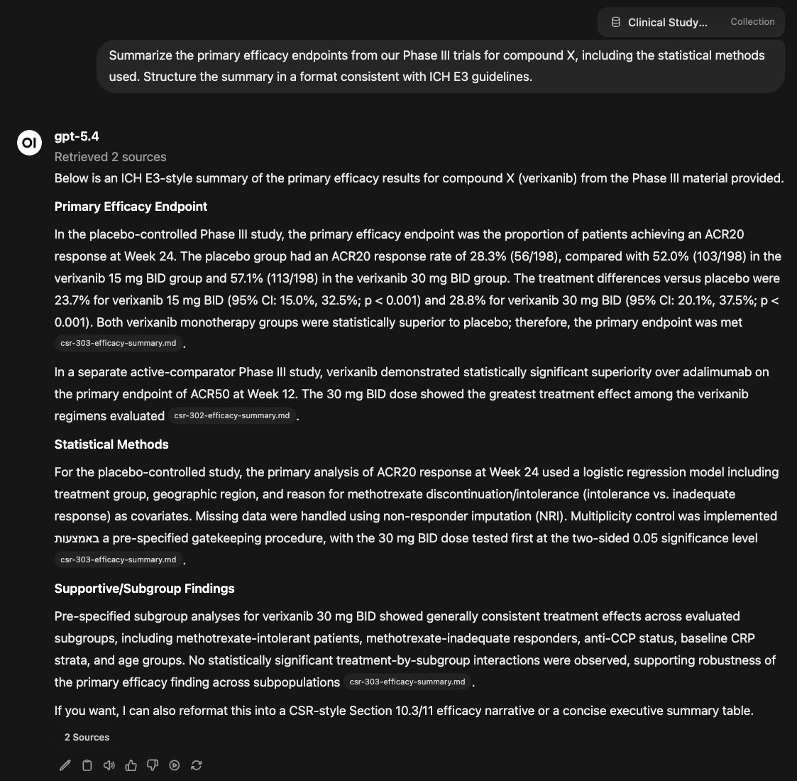
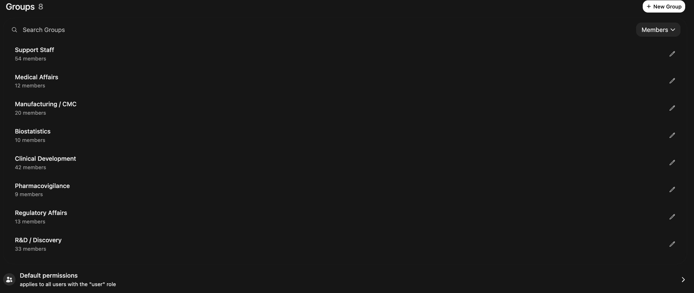
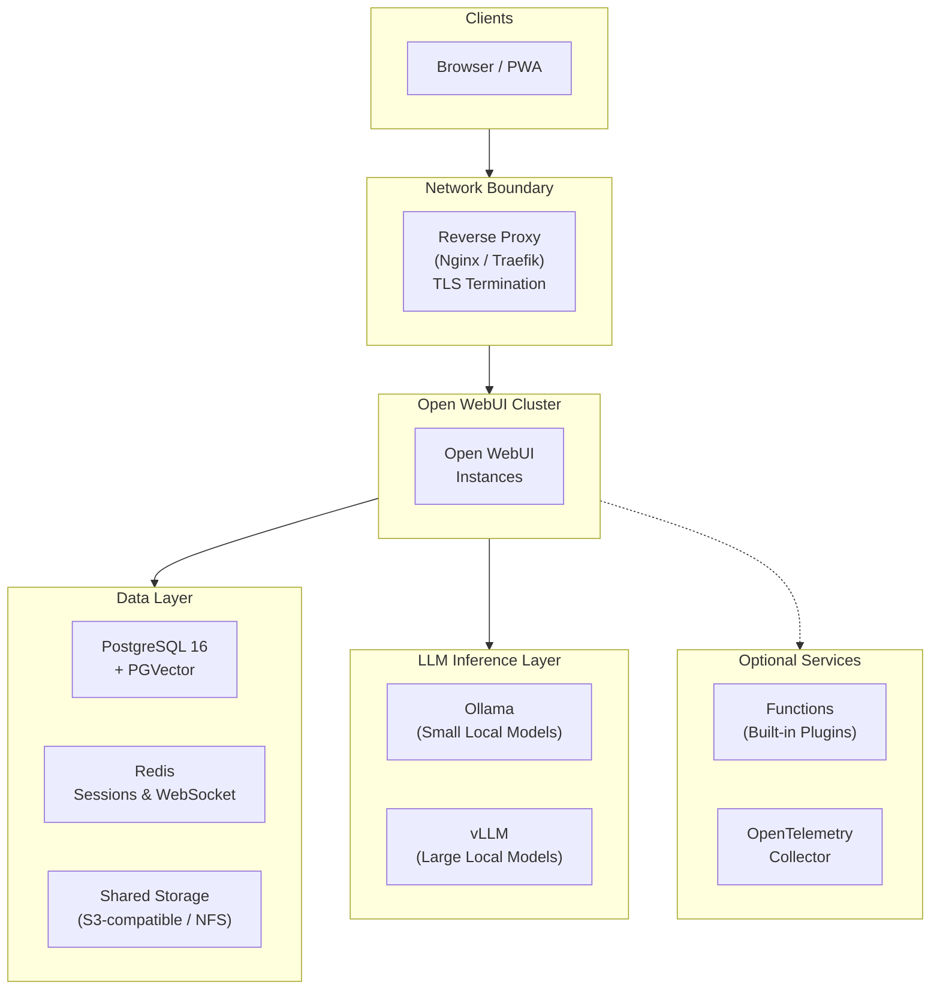

# Private AI for the Pharmaceutical Industry

*For R&D leaders, CIOs, and digital transformation executives evaluating AI solutions for their organization.*

<!-- TODO: Replace with hero image for social sharing previews -->

---

## The Problem

Drug development takes 10–15 years and costs over $2 billion on average. At every stage — target identification, lead optimization, clinical trial design, regulatory submission — scientists generate and interpret massive volumes of proprietary data. The pressure to use AI on that data is immense. The risk of doing it carelessly is existential.

Three specific challenges are slowing AI adoption across the pharmaceutical industry:

**The data you most want AI to analyze is the data you can least afford to expose.** Pre-IND compound structures, unpublished mechanism-of-action data, clinical endpoint designs, manufacturing process parameters — this is the intellectual property that underpins your pipeline. Sending it to a cloud LLM means relinquishing physical control. Even with contractual protections, once data hits a third-party API, you cannot guarantee how it's stored, cached, or used for model improvement. For organizations where a single patent filing depends on maintaining trade secret protection, that's not a manageable risk — it's a disqualifying one.

**Regulated workflows demand validated, auditable systems.** AI isn't exempt from GxP. If a scientist uses an LLM to draft a clinical study report section, summarize adverse events, or review CMC documentation, the tool that produced that output falls under the same scrutiny as any computerized system in a regulated environment. FDA 21 CFR Part 11 requires electronic records with audit trails, access controls, and attributable authorship. EMA Annex 11 imposes equivalent requirements. A SaaS chatbot that can't tell you who asked what, when, or what sources informed the answer doesn't meet that standard.

**Scientific hallucinations compound through the pipeline.** When an AI fabricates a drug-drug interaction, misattributes a clinical outcome to the wrong study arm, or cites a retracted paper, the consequences aren't just embarrassing — they can contaminate safety assessments, mislead regulatory reviewers, and delay or derail programs worth hundreds of millions. Scientists need every AI-generated claim traceable to a source document they can verify themselves.

The common thread: pharma needs AI infrastructure it can *deploy inside its own walls*, *validate against its own standards*, and *audit with its own tools*.

---

## What a Pharma AI Platform Needs

The market is full of "AI for life sciences" products — polished, well-funded, and quick to deploy. Most of them work the same way: your data goes to their servers, their models process it, and you get results back. For low-sensitivity use cases like drafting internal emails or summarizing public literature, that model works fine. For anything touching your pipeline, your patients, or your regulators, it creates dependencies you can't fully control.

Self-hosting changes the equation. Instead of trusting vendor claims about data handling, you verify them by inspecting the infrastructure yourself. Here's what that looks like concretely — and how [Open WebUI](https://docs.openwebui.com/), a self-hosted AI platform, delivers it:

- **Zero data exfiltration by design.** Open WebUI runs entirely on your infrastructure — on-premise data center, validated private cloud, or air-gapped environment. Models run locally via Ollama or vLLM. No prompts, no completions, no embeddings ever leave your network. There is nothing to trust because there is nothing external.

- **Source-grounded responses for scientific rigor.** Scientists query internal document collections — SOPs, study protocols, regulatory guidance, literature databases, pharmacopeia references — and receive answers with inline citations and relevance scores. Each citation links back to the original document. This doesn't make hallucination impossible, but it makes every claim verifiable.

- **Organizational access control out of the box.** Permissions map to your functional structure: R&D, Clinical, Regulatory, Pharmacovigilance, Manufacturing, Medical Affairs. Each group sees only the models, documents, and capabilities assigned to it. IT administrators can manage the platform without ever viewing the content of scientific conversations.

- **A complete audit trail for every interaction.** Every conversation is timestamped, attributed to an authenticated user, and retained according to your policy. Users cannot delete or create unlogged conversations. Combined with SSO integration, this produces the kind of electronic record that GxP auditors expect to see.

### What This Looks Like in Practice

A regulatory affairs scientist is preparing a Module 2.7 clinical summary for an eCTD submission. She opens Open WebUI and queries the company's internal knowledge base: *"Summarize the primary efficacy endpoints from our Phase III trials for compound X, including the statistical methods used."* The response pulls from three internal clinical study reports, cites each by document name with relevance scores, and structures the summary in a format consistent with ICH E3 guidelines. She clicks each citation to verify it against the source PDF. The entire exchange is logged under her SSO identity.

Two weeks later, during an FDA pre-submission meeting, a reviewer asks how a specific claim in the summary was generated. The QA team pulls up the audit trail: the exact query, the AI response, the source documents cited, and the timestamp — all attributable to a named user, all retained on company-controlled infrastructure.

<!-- TODO: Replace with real screenshot of chat UI showing inline citations and source panel -->

---

## Access Control for Functional Groups

Pharma organizations don't have one relationship with AI — they have many. A medicinal chemist analyzing SAR data has different needs and risk tolerances than a pharmacovigilance officer reviewing safety signals. Open WebUI's group system lets you configure each function independently:

<!-- TODO: Replace with screenshot of Admin Panel → Groups showing functional groups -->

| Functional Group | AI Capabilities | Knowledge Bases | Special Permissions |
|---|---|---|---|
| **R&D / Discovery** | Full | Compound libraries, assay protocols, literature databases | Code interpreter *(run analysis scripts on screening data)* |
| **Clinical Operations** | Full | Study protocols, CRF templates, monitoring plan libraries | Web search enabled |
| **Regulatory Affairs** | Full | eCTD templates, FDA/EMA guidance, precedent correspondence | Document extraction *(structured data from regulatory letters)* |
| **Pharmacovigilance** | Advanced analysis only | MedDRA dictionaries, CIOMS forms, signal detection SOPs | RAG-only mode *(responses restricted to validated source documents)* |
| **Manufacturing / CMC** | Full | Batch records, process validation reports, equipment SOPs | File upload enabled |
| **Medical Affairs** | Full | Product monographs, congress abstracts, KOL slide decks | Web search enabled |
| **Support Staff** | Basic tasks only | Company policies, HR procedures, training materials | No file upload, no web search |

Groups synchronize with your identity provider (Okta, Azure AD, Ping Identity) via OAuth, so when someone transfers between departments, their AI permissions update automatically on next login.

---

## What a Production Deployment Looks Like

*This section is a reference for your IT or infrastructure team. If you're evaluating Open WebUI at a strategic level, the key takeaway is: it deploys on your existing infrastructure (VMware, Azure, AWS, or bare metal), scales horizontally, and has zero external dependencies once models are loaded.*

For large pharma organizations (500–10,000+ employees), a production deployment needs high availability, data isolation, and GxP-ready infrastructure. Here's the reference architecture — for full deployment instructions, see the **[Technical Setup Guide](setup.md)**.

**Key design decisions:**
- **Stateless application nodes** — scale out during submission sprints, scale back during quieter periods; lose any single node without service interruption
- **All inference runs locally** — via Ollama (lightweight models for triage and summarization) and vLLM (large reasoning models for complex scientific analysis); nothing leaves the network
- **Unified data layer** — PostgreSQL handles both the audit-trail database and vector search (via PGVector), so there's one system to back up, validate, and secure
- **Redis session coordination** — enables multi-node deployments where any instance can serve any user seamlessly, critical for organizations operating across time zones

---

## Get Started

Open WebUI is **free to use**. Infrastructure costs depend on your organization's scale — a single-department pilot can run on one GPU server in your existing environment, while the full production architecture above involves dedicated compute and storage. A pilot can typically be running within hours; a full validated rollout takes a few weeks.

The complete Docker Compose stack, security hardening checklist, RBAC configuration guide, and backup strategy are in our companion technical guide:

**[Pharma Industry Technical Setup Guide →](setup.md)**

### Enterprise Support

If your organization wants hands-on deployment support, [Open WebUI Enterprise](https://docs.openwebui.com/enterprise/) is available for teams that prefer not to go it alone:

- **Regulatory alignment guidance** — 21 CFR Part 11, Annex 11, HIPAA, SOC 2, ISO 27001
- **White-label branding** — Match the AI interface to your corporate identity
- **Dedicated support & SLAs** — Direct engineering access for architecture review and incident response

Your compounds, your protocols, your models — on your infrastructure.

**[Learn more about Enterprise → sales@openwebui.com](mailto:sales@openwebui.com)**

---

*Open WebUI is free to use and self-hostable. It powers AI deployments at organizations ranging from small research teams to Fortune 500 companies. [See who's using Open WebUI →](https://docs.openwebui.com/enterprise/customers/)*
