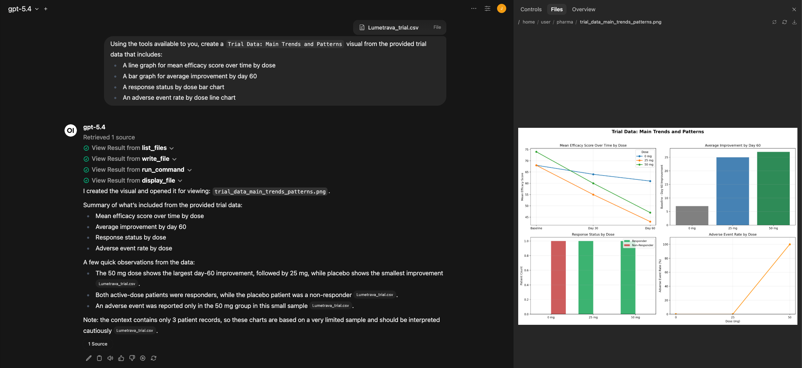
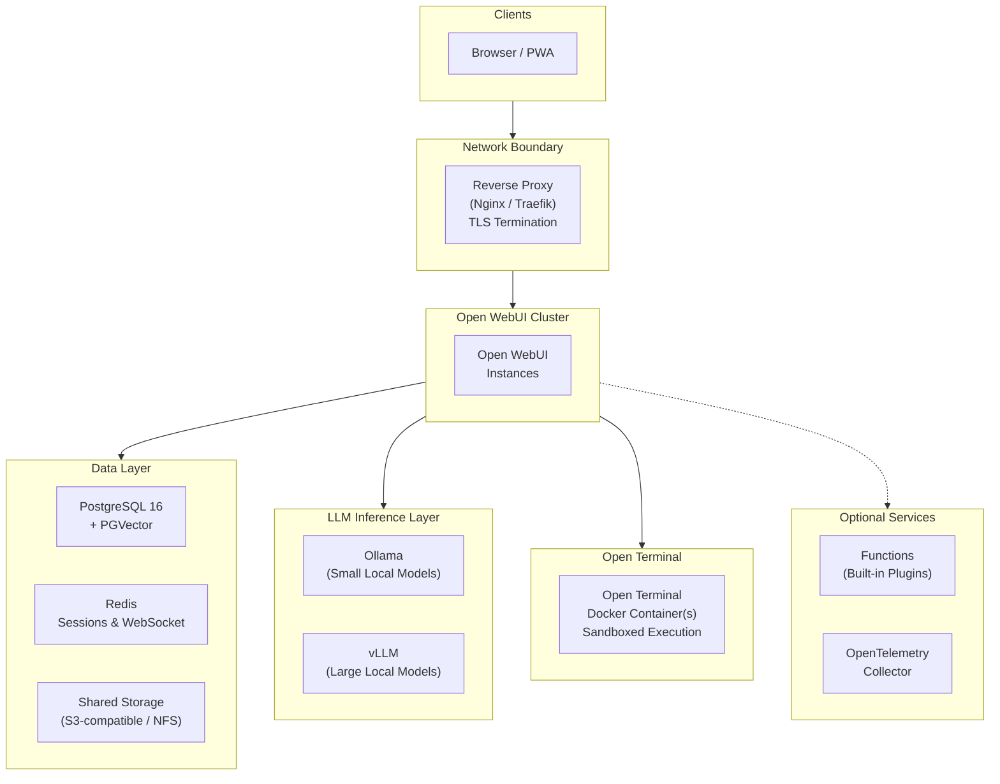

# What Would It Take for a Pharma Company to Run AI In-House?

*For R&D leaders, CIOs, and digital transformation executives evaluating AI solutions for their organization.*

*This article is for informational purposes only and does not constitute regulatory, legal, or compliance advice. Organizations should evaluate AI deployments with qualified counsel based on their regulatory environment, therapeutic areas, and data governance obligations.*

<!-- TODO: Replace with hero image for social sharing previews -->

---

## Why This Question Matters Now

The pharmaceutical industry's AI market is [projected to reach $25.7 billion by 2030](https://www.mordorintelligence.com/industry-reports/artificial-intelligence-in-pharmaceutical-market), up from roughly $4 billion today. Companies [invested more than $250 billion](https://hai.stanford.edu/ai-index/2025-ai-index-report/economy) in AI last year across all sectors. Yet amid this surge, medicine makers have yet to see substantially shorter development timelines or meaningful improvements in clinical success rates. The gap isn't whether to adopt AI — it's *how*.

The numbers reveal the disconnect. A 2024 Kiteworks study found that [**83% of pharmaceutical companies operate without automated safeguards**](https://www.contractpharma.com/exclusives/ai-data-security-the-83-compliance-gap-facing-pharmaceutical-companies/) to prevent sensitive data from leaking through AI tools. Only 17% have implemented technical controls like DLP scanning. The rest rely on training emails (40%), warnings without follow-up (20%), or have no AI usage policy at all (13%). McKinsey's [State of AI report](https://www.mckinsey.com/capabilities/quantumblack/our-insights/the-state-of-ai-how-organizations-are-rewiring-to-capture-value) found that 47% of organizations using generative AI have already experienced at least one negative consequence, with cybersecurity leading the list. Meanwhile, companies that simply [bolt AI onto existing workflows](https://www.mckinsey.com/industries/life-sciences/our-insights/the-synthesis/how-pharma-is-rewriting-the-ai-playbook-perspectives-from-industry-leaders) — the "tinkerers," as McKinsey calls them — aren't capturing meaningful value.

That backdrop is pushing some pharma companies to ask a more fundamental question: rather than relying solely on third-party AI platforms, what would it take to run AI internally? Four challenges are driving the conversation:

**The data you most want AI to analyze is the data you can least afford to expose.** Pre-IND compound structures, unpublished mechanism-of-action data, clinical endpoint designs, manufacturing process parameters — this is the intellectual property that underpins your pipeline. Sending it to a cloud LLM means relinquishing physical control. Even with contractual protections, once data hits a third-party API, you cannot fully guarantee how it's stored, cached, or used for model improvement. For organizations where a single patent filing depends on maintaining trade secret protection, that trade-off can be difficult to accept.

**Regulated workflows demand validated, auditable systems.** AI isn't exempt from GxP. If a scientist uses an LLM to draft a clinical study report section, summarize adverse events, or review CMC documentation, the tool that produced that output falls under the same scrutiny as any computerized system in a regulated environment. [FDA 21 CFR Part 11](https://www.ecfr.gov/current/title-21/chapter-I/subchapter-A/part-11) requires electronic records with audit trails, access controls, and attributable authorship. [EMA Annex 11](https://health.ec.europa.eu/system/files/2016-11/annex11_01-2011_en_0.pdf) imposes equivalent requirements. A SaaS chatbot that can't tell you who asked what, when, or what sources informed the answer raises questions under those frameworks.

**Scientific hallucinations compound through the pipeline.** When an AI fabricates a drug-drug interaction, misattributes a clinical outcome to the wrong study arm, or cites a retracted paper, the consequences aren't just embarrassing — they can contaminate safety assessments, mislead regulatory reviewers, and delay or derail programs worth hundreds of millions. Scientists need every AI-generated claim traceable to a source document they can verify themselves.

**Scientists who need computational AI the most can't always access it.** Drug discovery, clinical biostatistics, and pharmacometrics increasingly depend on computational workflows — running analyses, generating visualizations, fitting models. But [30% of IT-related positions in pharmaceutical companies remain unfilled](https://www.tracekey.com/en/skills-shortage-in-pharma/) in key markets, and the scientists with deep domain expertise are rarely the ones writing Python scripts. McKinsey's pharma leaders stress what J&J's Ashita Batavia calls ["trilingualism"](https://www.mckinsey.com/industries/life-sciences/our-insights/the-synthesis/how-pharma-is-rewriting-the-ai-playbook-perspectives-from-industry-leaders) — proficiency in data science, domain science, and business strategy — but acknowledge that finding people with all three is rare. The result: computational capability bottlenecks at the IT team, and scientists wait in queue instead of iterating on analyses.

These challenges share a common root: some pharma companies are asking whether AI they can *control*, *validate*, *audit*, and *put directly in scientists' hands* might be worth exploring — rather than relying solely on third-party platforms.

---

## What Self-Hosted AI Would Actually Require

There's no shortage of "AI for life sciences" products on the market — many are polished, well-funded, and quick to deploy. The strategic question is control: where data is processed, who can access it, and how confidently you can demonstrate that to regulators, auditors, and partners. For low-sensitivity use cases like drafting internal emails or summarizing public literature, shared infrastructure may be a reasonable trade-off. For anything touching your pipeline, your patients, or your regulatory submissions, tighter control is often worth evaluating.

If a pharma company were to explore self-hosted AI, what capabilities would matter? Based on the concerns above, the requirements tend to cluster around five areas:

- **Data locality.** The ability to run AI entirely on company-controlled infrastructure — on-premise data center, validated private cloud, or air-gapped environment. With the right configuration, this can reduce third-party data exposure, limit model training risk, and avoid external API calls for inference.

- **Source-grounded responses with citations.** The ability for scientists to query internal document collections — SOPs, study protocols, regulatory guidance, literature databases, pharmacopeia references — and receive responses with inline citations and relevance scores. This does not eliminate hallucination, but it can improve traceability for verification workflows. **All AI-generated content must be reviewed and verified by qualified scientists before reliance or use in any regulatory submission.**

- **Group-based access control.** The ability to map role-based permissions to functional groups (R&D, Clinical, Regulatory, Pharmacovigilance, Manufacturing, Medical Affairs), restrict administrators from viewing certain conversations, and control model access, document access, and feature access per group.

- **Configurable audit and retention controls.** Conversation logging, configurable retention, SSO integration, and restrictions on chat deletion that can support an organization's GxP compliance and audit requirements — including the kind of electronic records expected under [21 CFR Part 11](https://www.ecfr.gov/current/title-21/chapter-I/subchapter-A/part-11) and [Annex 11](https://health.ec.europa.eu/system/files/2016-11/annex11_01-2011_en_0.pdf).

- **Computational capabilities accessible through natural language.** The ability for scientists to run real code — Python, R, Julia — through conversational prompts, in sandboxed environments on internal infrastructure, without requiring programming expertise or IT tickets. This is what bridges the gap between domain scientists and the computational workflows they need.

These aren't unique to any one product — they're the criteria that organizations exploring self-hosted AI tend to evaluate against.

---

## One Approach: Open-Source Self-Hosting

[Open WebUI](https://docs.openwebui.com/) is a general-purpose, open-source AI platform that can be self-hosted. It's one example of a platform that can be configured to address the requirements above — organizations should evaluate whether and how its capabilities fit their own compliance and governance requirements.

### Illustrative Example

> **Note:** The following scenario is illustrative and does not represent a validated or endorsed workflow. Organizations must design, test, and validate their own AI workflows according to their regulatory and governance requirements.

A regulatory affairs scientist is preparing a Module 2.7 clinical summary for an eCTD submission. She opens Open WebUI, configured with the company's internal document library, and queries: *"Summarize the primary efficacy endpoints from our Phase III trials for compound X, including the statistical methods used."* The response can draw from internal clinical study reports, cite each by document name with relevance scores, and structure the summary in a format consistent with ICH E3 guidelines. She clicks each citation to verify it against the source PDF. The conversation can be logged under her SSO identity for search and audit workflows.

Two weeks later, during an FDA pre-submission meeting, a reviewer asks how a specific claim in the summary was generated. The QA team pulls up the audit trail: the exact query, the AI response, the source documents cited, and the timestamp — all attributable to a named user, all retained on company-controlled infrastructure. That level of traceability is increasingly expected in regulated environments.

Open WebUI also includes [Open Terminal](https://docs.openwebui.com/features/extensibility/open-terminal), which provides a sandboxed computing environment accessible through natural language. A scientist can attach a dataset from an Open WebUI Knowledge collection and describe the analysis they need — for example: *"Create a Trial Data: Main Trends and Patterns visual from the provided trial data that includes a line graph for mean efficacy score over time by dose, a bar graph for average improvement by day 60, a response status by dose bar chart, and an adverse event rate by dose line chart."* The AI executes real Python code with scientific libraries inside an isolated Docker container on the organization's infrastructure and returns visualizations directly in the chat.

This is what Genentech's John Marioni describes as a "lab-in-the-loop": the model predicts, the scientist validates, and both improve in a [virtuous cycle](https://www.mckinsey.com/industries/life-sciences/our-insights/the-synthesis/how-pharma-is-rewriting-the-ai-playbook-perspectives-from-industry-leaders). A medicinal chemist could just as easily upload a compound library and ask for a structure-activity relationship analysis using RDKit. No data leaves the network. No IT ticket required.

---

## What Access Control Could Look Like

Open WebUI includes a group-based access control system. The table below shows one example of how a pharma company might map functional groups to AI capabilities. **This is an illustrative configuration — organizations should design their own group structure based on their specific needs, risk tolerance, and governance requirements.**

| Functional Group | AI Capabilities | Knowledge Bases | Special Permissions |
|---|---|---|---|
| **R&D / Discovery** | Full | Compound libraries, assay protocols, literature databases | Open Terminal *(SAR analysis, molecular modeling, visualization)*, code interpreter |
| **Clinical Operations** | Full | Study protocols, CRF templates, monitoring plan libraries | Open Terminal *(survival analysis, enrollment dashboards)*, web search enabled |
| **Regulatory Affairs** | Full | eCTD templates, FDA/EMA guidance, precedent correspondence | Document extraction *(structured data from regulatory letters)* |
| **Pharmacovigilance** | Advanced analysis only | MedDRA dictionaries, CIOMS forms, signal detection SOPs | RAG-only mode *(responses grounded in validated source documents)* |
| **Manufacturing / CMC** | Full | Batch records, process validation reports, equipment SOPs | Open Terminal *(batch trend analysis, process parameter visualization)*, file upload |
| **Medical Affairs** | Full | Product monographs, congress abstracts, KOL slide decks | Web search enabled |
| **Support Staff** | Basic tasks only | Company policies, HR procedures, training materials | No file upload, no web search, no terminal access |

Groups can synchronize with your identity provider (Okta, Azure AD, Ping Identity) via OAuth, so functional group membership can stay aligned with your organization's directory.

---

## What Infrastructure Is Involved

*This section is a reference for your IT or infrastructure team. If you're evaluating at a strategic level, the key takeaway is simple: a self-hosted AI platform can run on existing infrastructure (VMware, Azure, AWS, or bare metal), scale with the organization, and be deployed with minimal external dependencies.*

For large pharma organizations (500–10,000+ employees), a production deployment typically requires high availability, data isolation, and GxP-ready infrastructure. Here's a reference architecture using Open WebUI — for full deployment instructions, see the **[Technical Setup Guide](setup.md)**.

**Key design decisions:**
- **Stateless application nodes** — horizontal scaling allows capacity to flex with demand across the organization
- **Inference can run locally** — via Ollama (lightweight models) and vLLM (large models with GPU optimization), so prompts can stay on-network when configured accordingly
- **Unified data layer** — PostgreSQL handles both application data and vector search, reducing operational complexity
- **Redis session coordination** — enables multi-node deployments where any instance can serve any request seamlessly
- **Sandboxed Open Terminal containers** — each terminal runs in an isolated Docker container with resource limits enforced; scientists get a full computing environment while IT maintains control

---

## Considerations Before Getting Started

Self-hosting AI is not trivial. Before committing, organizations should consider:

- **Infrastructure costs.** Open WebUI itself is free, but GPU servers, storage, and networking are not. A single-department pilot may run on one GPU server; an organization-wide deployment involves dedicated compute and storage.
- **Governance design.** Who approves AI use cases? How are outputs reviewed? What's the policy for AI-assisted work product in regulatory submissions? These questions matter more than the technology.
- **Validation and testing.** Any AI deployment in a GxP environment should go through computerized system validation (CSV), security review, and integration testing before production use. This is typically a multi-week program.
- **Ongoing maintenance.** Model updates, security patches, user support, and knowledge base curation are ongoing responsibilities.

For organizations that want to explore the technical details, the complete Docker Compose stack (including Open Terminal configuration), security hardening checklist, RBAC configuration guide, and backup strategy are in our companion guide:

**[Technical Setup Guide →](setup.md)**

For organizations that want deployment guidance, [Open WebUI Enterprise](https://docs.openwebui.com/enterprise/) offers hands-on support including regulatory alignment guidance *(compliance determination remains the organization's responsibility)*, white-label branding, and dedicated SLAs.

*Note: No software alone establishes regulatory compliance. Organizations should validate controls, policies, and use cases with qualified regulatory, legal, and security teams.*

**[Learn more about Enterprise → sales@openwebui.com](mailto:sales@openwebui.com)**

---
