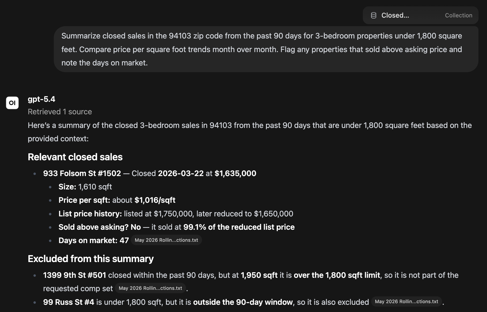
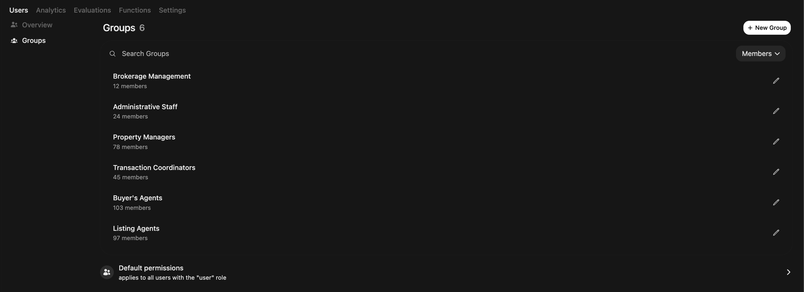
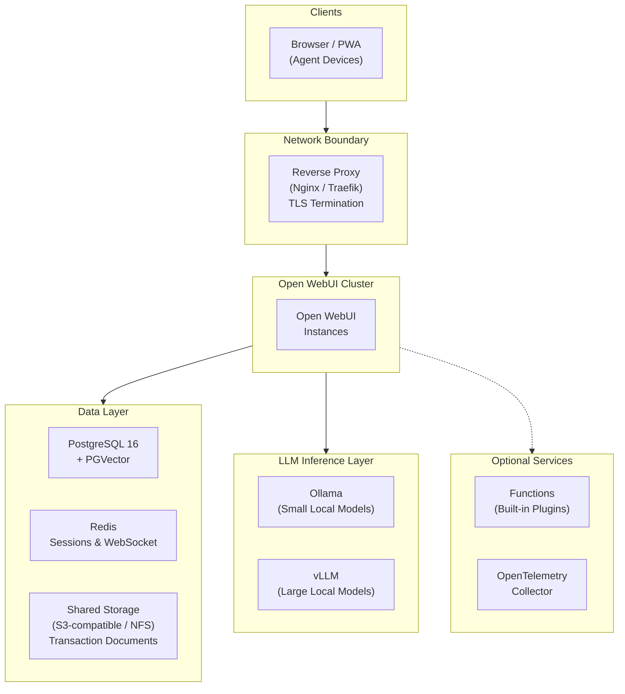

# What Would It Take for a Real Estate Brokerage to Run AI In-House?

*For broker-owners, managing brokers, CIOs, and technology leaders evaluating AI solutions for their brokerage or team.*

*This article is for informational purposes only and does not constitute legal, regulatory, compliance, real estate, or investment advice. Organizations should evaluate AI deployments with qualified counsel based on their jurisdiction, regulatory environment, and data governance obligations.*

---

## Why This Question Matters Now

The statistics for AI usage in real estate tell two different stories. In one, AI has swept through real estate almost overnight. A [2026 leadership survey by WAV Group and Delta Media](https://www.wavgroup.com/2026/01/30/top-ai-survey-of-real-estate-leaders-shows-ai-moving-from-agent-adoption-to-brokerages-creating-safe-infrastructure/) reported that **97% of brokerage leaders say their agents are using AI tools** — up from 80% two years ago. A separate [NAR survey reported that 68% of agents now use AI](https://www.nar.realtor/newsroom/realtors-embrace-ai-digital-tools-to-enhance-client-service-nar-survey-finds), with 20% using it daily. Industry analysts estimated proptech VC funding reached $16.7 billion in 2025, a 68% year-over-year increase at the time of those estimates, with AI-centered companies growing at roughly twice the rate of the broader sector.

In the other story: only 17% of agents report AI has had a significant positive impact on their business. [JLL's global CRE technology survey](https://www.jll.com/en-us/insights/global-real-estate-cre-technology-survey) found that while 92% of commercial real estate teams have started piloting AI, only 5% report having achieved most of their program goals. The same survey found that large CRE organizations average **367 different software tools**. The data fragmentation problem is so severe that 61% of firms report relying on legacy core infrastructure that they need to address before AI can be meaningfully leveraged.

The gap between those two stories is where most brokerages currently live: agents using AI constantly, with brokerages struggling to translate that activity into durable value. But a third story is now developing beneath both, and it's the one that may matter most.

That story is about risk. According to [WAV Group's January 2026 analysis of AI risk in real estate](https://www.wavgroup.com/2026/01/26/shadow-ai-is-one-of-real-estates-biggest-hidden-risks/), while only 40% of companies have formal AI subscriptions, more than 90% of employees are using generative AI daily. In real estate, where agents are typically independent contractors, the gap is even wider: agents are adopting ChatGPT, Claude, Gemini, and other tools without brokerage oversight, without data processing agreements, and without any record of what client information was shared. WAV Group calls this "shadow AI", and they describe it as one of real estate's biggest hidden risks.

Four challenges are driving brokerages to ask a more fundamental question about how to manage AI:

**The most valuable data for AI analysis is often the most sensitive to expose.** When an agent pastes a buyer's pre-approval letter, a client's net worth disclosure, or transaction details into a personal ChatGPT account, that data is subject to the terms of service of a consumer product, rather than a business data processing agreement. Brokerages may be exposed to data breach liability they didn't create and may not be aware of. Cyber insurers are beginning to require documented AI policies as a condition of coverage, and many brokerages have neither.

**MLS data has a sovereignty problem that AI is making urgent.** [A January 2026 analysis by WAV Group](https://www.wavgroup.com/2026/01/23/mls-data-ai-and-the-line-between-innovation-and-risk/) describes the core tension directly: "the value of MLS data can be reconstructed, inferred, or redeployed outside the MLS ecosystem." When agents or vendors feed MLS data into third-party AI tools, that data may be used to improve models — making copyright protection difficult to enforce once it's embedded in model weights. MLS subscriber agreements typically require members to control how data is used, and feeding it to external AI APIs may not be consistent with those terms. FBS's launch of the [Flexmls MCP Server in April 2026](https://www.rismedia.com/2026/04/24/fbs-launches-flexmls-mcp-server-bringing-mls-data-into-ai-workflows/) (which connects AI tools to live MLS data with subscriber-level authentication) signals that the industry is beginning to build controlled access patterns, but many brokerages are ahead of those guardrails in their day-to-day AI usage.

**Fair housing compliance is newly exposed by AI-generated content.** In May 2024, HUD issued [formal guidance confirming that the Fair Housing Act applies to AI-generated advertising and tenant screening tools](https://archives.hud.gov/news/2024/pr24-098.cfm). Both the providers and users of AI tools can be liable under the disparate impact standard, meaning a brokerage whose AI-generated listing copy steers toward or away from protected classes could face enforcement, regardless of intent. A [Spencer Fane analysis](https://www.spencerfane.com/insight/the-next-frontier-of-fair-housing-risk-ai-chatbots-and-early-stage-applicant-interactions/) of AI chatbot risk in leasing warns that fair housing exposure via AI "may develop more quickly and across a broader group of individuals than in traditional leasing environments." And in January 2026, California's AI disclosure law took effect — [making it a misdemeanor to publish AI-altered listing photos without disclosure and access to the original unaltered image](https://neuhausre.com/ai-real-estate-compliance-disclosure-guide-2026/).

**The implementation gap is real, and the cost is compounding.** Even brokerages that have invested in AI tools are struggling to capture value. JLL's survey found that 81% of CRE firms report at least three underperforming legacy systems, and only 33% of employees feel adequately trained on AI. [McKinsey's 2025 analysis of agentic AI in real estate](https://www.mckinsey.com/industries/real-estate/our-insights/how-agentic-ai-can-reshape-real-estates-operating-model) estimated that automation could unlock $430–550 billion in annual value across real estate, construction, and development. However, capturing that value requires moving past tool adoption toward workflow integration, governance, and infrastructure design.

These challenges are leading some brokerage leaders to ask whether AI they can *control*, *observe*, and *govern centrally* might be worth exploring — rather than letting individual agents manage their own AI relationships with no brokerage visibility.

---

## What Self-Hosted AI Would Actually Require

There is no shortage of AI tools marketed to real estate professionals. Most follow the same model: sign up, connect your data, pay per seat. For routine tasks with low sensitivity (drafting cold outreach, generating caption variations for social posts, or summarizing published market reports), that tradeoff may be straightforward. But the moment an agent's workflow touches a client's financial information, a transaction document, MLS export data, or a fair-housing-adjacent communication, the risk profile changes. The question shifts from *"can agents use AI?"* to *"can we demonstrate — to a regulator, an E&O carrier, or a client who asks — where that AI-generated output came from, what data was used, and that it remained on infrastructure the brokerage controls?"*

That question is what pushes some brokerages toward evaluating self-hosted AI. When organizations begin thinking about this seriously, the requirements tend to cluster around five areas:

- **Data locality.** The ability to run AI entirely on brokerage-controlled infrastructure, whether it's an on-premise server, a private cloud environment, or a managed virtual machine. With the right configuration, this can reduce third-party data exposure, minimize the risk that client data is used for model training, and reduce external API calls for inference. For brokerages handling sensitive transaction data or operating under MLS subscriber agreements, the ability to keep data on-premises is increasingly worth evaluating.

- **Source-grounded responses with citations.** The ability for agents to query the brokerage's internal documents — closed transaction records, listing histories, disclosure templates, policy guides, market reports — and receive responses with inline citations and relevance scores. This does not eliminate hallucination, but it can improve traceability for verification workflows. **All AI-generated content must be reviewed and verified by a licensed real estate professional before reliance or use in any client-facing context.**

- **Group-based access control.** The ability to map role-based permissions to agent roles and business functions — buyer's agents, listing agents, transaction coordinators, property managers, administrative staff, and management — and restrict which knowledge bases, models, and features each group can access. This matters both for data governance and for ensuring agents are working with appropriate information for their role.

- **Configurable audit and retention controls.** Conversation logging, configurable retention periods, SSO integration, and restrictions on chat deletion that can support brokerage governance requirements, E&O insurance documentation obligations, and any regulatory inquiries. Having a record of what AI-assisted queries produced what outputs — tied to named users — is increasingly relevant in an environment where fair housing enforcement is expanding to cover AI tools.

- **Computational capabilities accessible through natural language.** The ability for agents and team leads to run real analysis — market trend charts, pricing visualizations, MLS data summaries — through conversational prompts, without requiring programming expertise or reliance on a dedicated data analyst. This can help bridge the gap between the market intelligence agents need and the technical barriers that currently prevent many of them from accessing it.

These aren't unique to any one product. They are the criteria that brokerage technology leaders exploring self-hosted AI tend to evaluate against.

---

## One Approach: Self-Hosting

[Open WebUI](https://docs.openwebui.com/) is a general-purpose, self-hostable AI platform with a publicly available codebase. It's one example of a platform that can be configured to address the requirements above — brokerages should evaluate whether and how its capabilities fit their own compliance, governance, and operational requirements.

### Illustrative Examples

> **Note:** The following scenarios are illustrative and do not represent validated or endorsed workflows. All property addresses, transaction details, client names, and market figures in these scenarios are entirely fictional and created solely for illustration. Organizations must design, test, and validate their own AI workflows according to their regulatory and governance requirements. All AI-generated content must be reviewed and verified by a licensed real estate professional before reliance or use in any client-facing context.

#### Comparative Market Analysis from Internal Transaction History

A listing agent is preparing for a seller consultation on a three-bedroom craftsman in a San Francisco neighborhood. She has 45 minutes before the appointment. Normally, pulling comps would mean navigating MLS filters, exporting data, cross-referencing her own memory of recent closings, and assembling the relevant figures in a presentation. Instead, she opens Open WebUI, configured with the brokerage's internal closed-sales knowledge base — a structured collection of the firm's transaction records going back five years, including final sales prices, days on market, price reductions, and notes from the listing agents.

She types: *"Summarize closed sales in the 94103 zip code from the past 90 days for 3-bedroom properties under 1,800 square feet. Compare price per square foot trends month over month. Flag any properties that sold above asking price and note the days on market."*

The response can draw from the brokerage's internal comp library, can cite each transaction by street address and MLS number with relevance scores, and can structure the summary in a format she can use in her listing presentation. She clicks each citation to verify it against the original closing statement. The AI surfaces several properties that sold above asking in a recent week — a cluster she hadn't noticed — and notes a declining trend in median days on market over the period. She reviews the findings and adjusts her pricing recommendation before walking into the appointment.

The conversation is logged under her SSO identity. If a fair housing question ever arose about how a pricing recommendation was developed, the conversation log — showing which transactions were queried and what the AI returned — can be retained in the brokerage's system, rather than existing only in a personal email account.

#### Disclosure Packet Analysis

A buyer's agent is representing a first-time buyer on a condominium in contract. The listing side has delivered a 47-page disclosure packet: a Transfer Disclosure Statement, a Natural Hazard Disclosure report, a home inspection report, a pest inspection, and the HOA meeting minutes from the past two years. Her client has 17 days to complete the inspection contingency. She needs to understand what's in the packet, flag the significant items for her buyer, and identify anything that looks incomplete or unresolved.

She uploads the PDF stack to Open WebUI and types: *"Identify any flagged items in these disclosures that are not addressed or resolved by the seller. List any sections that appear incomplete based on California disclosure requirements. Summarize the three most significant findings for my buyer, and note any items that may require further investigation before the contingency deadline."*

The AI can read the packet and return a structured analysis. It surfaces two items in the home inspection report marked "further evaluation recommended" — one for the electrical panel, one for evidence of moisture intrusion near the foundation — that do not appear to have a corresponding seller response or repair documentation in the TDS. It identifies what may be a missing flood zone designation for a property on a boundary parcel, and flags that the HOA meeting minutes reference a special assessment vote with no resolution noted in a subsequent meeting.

The agent reviews each finding against the source pages before sending a summary to her buyer. She recommends extending the contingency to allow for a second-opinion electrical inspection. The conversation is retained in the brokerage's system for E&O documentation — a record of the due diligence workflow her firm supported.

#### MLS Market Trend Visualization with Open Terminal

A team lead at a mid-size residential brokerage prepares a monthly market report for his top 30 seller clients. He's been doing this manually for three years: export data from the MLS, paste it into a spreadsheet, create charts in Excel, format a PDF. The process takes most of a Friday afternoon.

He exports his MLS market activity report for Q1 2026 — active listings, pending sales, and closed transactions for his core zip codes — as a CSV file. He uploads it to an [Open Terminal](https://docs.openwebui.com/features/extensibility/open-terminal) session in Open WebUI, a sandboxed computing environment where code can be generated and executed directly in the interface. He types:

*"From this MLS export, create three visualizations: (1) a line chart showing median days on market by week over the past 90 days, (2) a scatter plot of list price versus close price for all closed sales, color-coded by property type — single family, condo, and multi-unit — and (3) a bar chart of average price per square foot by neighborhood for single-family homes. Use a clean, presentation-ready style."*

The AI can read the dataset, write and execute the visualization code inside a sandboxed Docker container on the brokerage's own infrastructure, and return the finished figures directly in the chat. He reviews the output and notices that one neighborhood's price-per-sqft appears to have declined over the past six weeks — a trend his agents hadn't flagged in their weekly check-ins. He downloads the figures and embeds them in his client report.

When configured to run without external connections, the MLS data can remain on the brokerage's own infrastructure. The team lead has a potential talking point — that neighborhood pricing shift — that his agents can investigate further ahead of seller consultations.

#### Purchase Agreement Review and Deadline Extraction

A transaction coordinator is managing 14 active escrows. A new purchase agreement arrives — a 23-page California Residential Purchase Agreement for a townhome in contract. She needs to set up the transaction file, enter all key dates into the timeline tracker, and alert the buyer's agent to any contingency deadlines that fall on unusual dates.

She uploads the signed agreement to Open WebUI and types: *"From this purchase agreement, extract all contingency deadlines, the conditions required for removal, and any dates that require agent action. Format them as a checklist sorted chronologically. Flag any contingency removal dates that fall on a weekend or federal holiday, and note any clauses with ambiguous or conditional language that may require attorney review."*

The AI can parse the agreement and return a structured checklist with key contingency dates, flagging a loan contingency removal date that falls on a federal holiday. It surfaces a clause referencing a seller credit "contingent upon lender approval" without specifying approval criteria, noting the language may warrant attorney review.

She forwards the checklist to the buyer's agent along with a note about the holiday deadline and the flagged clause. The holiday conflict is surfaced early in escrow — rather than close to the deadline when a missed date becomes a dispute. The agent follows up with the listing side to clarify the credit language before the appraisal is ordered.

This is the kind of operational workflow that firms like [ListedKit AI](https://listedkit.com/) and [Trackxi](https://trackxi.com/) have built purpose-built tools around — AI-powered contract extraction that processes agreements in seconds and calculates deadline chains automatically. Open WebUI could offer a brokerage a similar capability through a configurable, self-hosted platform, with the added consideration that the purchase agreement documents could remain on brokerage-controlled infrastructure rather than third-party servers.

#### Fair Housing Compliance Review

A property manager at a boutique residential brokerage is updating the marketing copy for three new rental listings. She wants to review the outreach email she's drafting before it goes out, to check whether any language could raise a fair housing concern.

She pastes her draft listing descriptions and email copy into Open WebUI and types: *"Review this listing copy and outreach email for any language that could be interpreted as discriminatory under the Fair Housing Act. Look for preference statements, coded language, or exclusionary phrases related to protected classes — including race, color, national origin, religion, sex, familial status, and disability. Flag any items that may warrant a closer look and suggest neutral alternatives."*

The AI can review the copy and surface items that may warrant closer review: the phrase "perfect for young professionals" in the two-bedroom listing (a phrase that may raise familial status questions — it could be read as implying a preference against families with children), "quiet, established neighborhood" in the home listing (a phrase that has appeared in fair housing cases as coded language, though context and local guidance matter), and "walking distance to everything" in the ground-floor unit listing (a phrase that may de-emphasize accessible features in a unit where those features could be particularly relevant — a suggested alternative might be "conveniently located with ground-floor access and proximity to transit"). It can return suggested alternative language for each flagged phrase.

She reviews the suggestions, makes her own judgment on each, accepts some edits, and adjusts others independently based on context. She notes the review in the transaction file.

This kind of pre-publication review workflow is becoming more relevant, not less. [HUD's 2024 fair housing guidance](https://archives.hud.gov/news/2024/pr24-098.cfm) confirmed that the Act applies to AI-generated content — meaning brokerages that let agents use AI tools for listing copy without review may be accepting fair housing exposure they haven't fully assessed. [Spencer Fane's analysis](https://www.spencerfane.com/insight/the-next-frontier-of-fair-housing-risk-ai-chatbots-and-early-stage-applicant-interactions/) of AI chatbots in leasing environments found that fair housing exposure via AI "may develop more quickly and across a broader group of individuals than in traditional leasing environments." A documented review workflow, retained in a brokerage-controlled system, can reflect a good-faith compliance effort — though organizations should evaluate their specific fair housing obligations with qualified counsel.

---

## What Access Control Could Look Like

Open WebUI provides a group-based access control system. The table below shows one example of how a brokerage might map functional roles to AI capabilities. **This is an illustrative configuration — organizations should design their own role structure based on their specific needs, risk tolerance, governance requirements, and applicable MLS subscriber agreements.**

| Role | AI Capabilities | Knowledge Bases | Special Permissions |
|---|---|---|---|
| **Listing Agents** | Full | Internal comp library, listing templates, marketing copy library, neighborhood reports | Web search enabled |
| **Buyer's Agents** | Full | Disclosure templates, buyer guides, neighborhood data, contract checklists | Document extraction *(extract structured data from disclosures and purchase agreements)* |
| **Transaction Coordinators** | Advanced analysis only | Contract templates, deadline checklists, title and escrow contacts, state-specific contingency guides | Document extraction *(extract dates, parties, and contingencies from purchase agreements)* |
| **Property Managers** | Full | Lease templates, maintenance SOPs, fair housing guidance, local rental regulations | RAG-only mode *(responses grounded in curated internal documents)* |
| **Administrative Staff** | Basic tasks only | Office policies, HR procedures, training materials | No file upload, no web search |
| **Brokerage Management** | Full | All knowledge bases, analytics exports, agent performance data | Open Terminal *(market trend analysis, production dashboards, brokerage reporting)*, all permissions |

Groups can synchronize with the organization's identity provider (such as Okta, Azure AD, or Google Workspace) via OAuth, so role membership can stay aligned with the organization's directory as agents join, leave, or change teams.

---

## What Infrastructure Is Involved

*This section is a reference for the IT or technology team. If evaluating at a strategic level, the key takeaway is: a self-hosted AI platform can run on existing infrastructure — cloud VMs, on-premise servers, or a managed private cloud — and be deployed with dependencies that can run on internal infrastructure.*

For a mid-size brokerage (50–500 agents), a production deployment typically requires high availability and data isolation. Here's a reference architecture using Open WebUI — for full deployment instructions, see the **[Technical Setup Guide](setup.md)**.

**Key design decisions:**
- **Stateless application nodes** — horizontal scaling allows capacity to flex as the brokerage grows or usage peaks during busy transaction seasons
- **Inference can run locally** — via Ollama (lightweight models) and vLLM (large models with GPU optimization), so agent prompts and client documents can remain on-network when configured accordingly
- **Unified data layer** — PostgreSQL handles both application data and vector search, reducing operational complexity and keeping the brokerage's transaction document index on-premises
- **Redis session coordination** — enables multi-node deployments without requiring session affinity, supporting brokerage deployments across multiple locations

---

## Considerations Before Getting Started

Self-hosting AI is not trivial. Before committing, brokerages should consider:

- **Infrastructure costs.** Open WebUI itself is free to use (see license for terms), but the servers, storage, and networking required to run it are not. A single-team pilot may run on a single GPU-equipped VM; a firm-wide deployment involves dedicated compute, redundant storage, and ongoing network costs. GPU hardware for running larger local models is the most significant variable — the right configuration depends on how many concurrent users the brokerage expects and what model capabilities are required.

- **Governance design.** What is the brokerage's AI use policy? Who approves new AI use cases? How are outputs reviewed before use in client communications or regulatory filings? What happens when an agent uses AI-generated content that turns out to be inaccurate? These governance questions matter more than the technology selection — and they should be resolved before deployment, ideally in consultation with the brokerage's E&O carrier and legal counsel.

- **MLS subscriber agreement review.** Any brokerage connecting AI tools to MLS data should review its subscriber agreement — specifically provisions about permissible data use, third-party sharing, and automated access. The emerging [Flexmls MCP Server model](https://www.rismedia.com/2026/04/24/fbs-launches-flexmls-mcp-server-bringing-mls-data-into-ai-workflows/) suggests that MLSs are beginning to create sanctioned AI integration pathways, but those pathways vary by MLS. Brokerages should not assume that self-hosting resolves all MLS data governance questions — those depend on the specific subscriber terms.

- **Validation and testing.** Any AI deployment should go through security review, governance controls design, and integration testing before production use. This is typically a multi-week program, and shortcuts taken here tend to reappear as incidents later.

- **Ongoing maintenance.** Model updates, security patches, knowledge base curation, user access reviews, and fair housing policy alignment are ongoing responsibilities. Self-hosting shifts that operational responsibility from a vendor to the brokerage's own team or a managed services partner.

For brokerages that want to explore technical implementation details, the complete Docker Compose stack, RBAC configuration guide, and security hardening checklist are in our companion guide:

**[Technical Setup Guide →](setup.md)**

For organizations that want deployment guidance, [Open WebUI Enterprise](https://docs.openwebui.com/enterprise/) offers hands-on support including security and compliance guidance *(compliance determination remains the organization's responsibility)*, white-label branding, and dedicated SLAs.

*Note: No software alone establishes legal compliance. Organizations should validate controls, policies, and use cases with qualified legal, compliance, and real estate counsel.*

**[Learn more about Enterprise → sales@openwebui.com](mailto:sales@openwebui.com)**

---

*This article is for informational purposes only. It does not constitute legal, regulatory, compliance, real estate, or investment advice, and should not be relied upon as such. Real estate regulations, fair housing requirements, MLS subscriber obligations, and data governance standards vary by jurisdiction and change over time. Brokerages and agents should evaluate any AI deployment with qualified legal counsel, their E&O carrier, and their MLS before implementation. Open WebUI is a self-hostable platform with a publicly available codebase; its capabilities depend on how it is configured and deployed by the organization. Mention of third-party statistics, regulations, or platforms is for informational context only and does not represent an endorsement or a guarantee of outcomes.*
